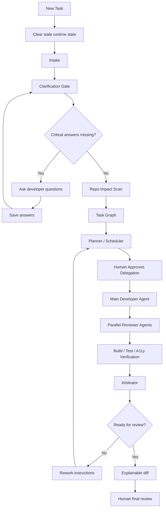

# Oracle Developer Twin Agentic Implementation Plan

Status: Frozen v1  
Date: 2026-05-14  
Owner: ODT product/engineering  

Update, 2026-05-15: the current product direction is implemented in `/Users/vn105957/Desktop/odt-submission/odt-workbench-next`. ODT Workbench is now positioned as a governed AI-assisted developer workbench that moves from requirement/Jira/repo input to PR-ready implementation while enforcing Oracle-style UX, accessibility, security, compliance, 3PL, testing, and code-quality standards. The existing FEDIT/dashboard output remains legacy/reference material; new product work should use the Standards & Governance Layer, Standards Command Center, evidence tables, approval gates, and PR Readiness Pack documented under `odt-workbench-next/docs/`.

Follow-up, 2026-05-15: Intake must support selecting an existing repository or folder by local path, read-only repo analysis, and context attachments through the ODT Context Vault. Uploaded mockups, screenshots, PDFs, DOCX, spreadsheets, API samples, and notes are copied under `odt-workbench-next/workspaces/<assignment>/intake-assets`; they must not be copied into the target repo automatically. ODT Guide may use lightweight local retrieval over docs, standards, evidence, repo analysis, and intake asset metadata to answer with detailed steps until the future Oracle DB vector/RAG layer exists.

This is the frozen implementation plan for evolving Oracle Developer Twin from a static seven-stage planning workflow into a practical, developer-usable agentic delivery workbench.

The plan can be updated later, but this version is the baseline direction.

## North Star

ODT should work like a local AI delivery lead for developers.

It should:

- accept a ticket, defect, or large feature request
- ask critical questions before guessing
- remember answers for the current task
- clear stale state for new tasks
- inspect the repo
- plan the task order
- coordinate one main coding agent and multiple reviewer agents
- pause when human input is needed
- continue when answers are provided
- produce reviewable code, tests, accessibility evidence, and explainable diffs

## Product Decision

Build ODT as:

```text
ODT Studio
  Desktop app: Electron later
  Core engine: Node.js, current ODT packages
  UI: existing FEDIT/ODT Workspace first
  Agents: Codex/Cline/local CLI workers
  Python: optional helper workers only
```

Do not rewrite the core in Python.

Do not start with many agents editing files at the same time.

Start with a safe orchestration model:

```text
Planner / Scheduler
Requirement Clarifier
Repo Cartographer
Architect
Main Developer
Parallel Reviewers
Arbitrator
Human Review
```

## Frozen Workflow



## Agent Roles

### 1. Supervisor

Owns run state, task lifecycle, pause/resume, and stop conditions.

Artifacts:

- `reports/odt/agentic/run-state.json`
- `reports/odt/conversation/state.json`

### 2. Requirement Clarifier

Asks only decision-critical questions.

Examples:

- missing acceptance criteria
- missing target repo
- missing observed/expected behavior for defects
- unclear mock-data policy
- unclear dependency policy
- unclear test scope

Artifacts:

- `reports/odt/clarifications/questions.json`

### 3. Repo Cartographer

Reads the repo and maps likely impacted files/modules.

Artifacts:

- `reports/odt/impact-ranked-files.json`
- `reports/odt/agentic/repo-map.json`

### 4. Task Decomposer

Splits large work into implementation slices.

Artifacts:

- `reports/odt/agentic/task-graph.json`

### 5. Planner / Scheduler

Decides what to do first, what can run in parallel, what is blocked, and what should wait.

This agent is mandatory for large feature work.

Artifacts:

- `reports/odt/agentic/execution-plan.json`
- `reports/odt/agentic/scheduler-decision.json`

### 6. Architect

Checks technical approach, boundaries, reuse, and repo conventions.

Artifacts:

- `reports/odt/tech-design.md`
- `reports/odt/agentic/architect-review.md`

### 7. Main Developer

The only default code-writing agent in v1.

Reason:

- fewer merge conflicts
- clearer ownership
- easier review
- safer for enterprise repos

Artifacts:

- changed files in target repo
- `reports/odt/execute/agent-response.md`

### 8. Reviewer Agents

Run in parallel after the main developer produces code.

Reviewer agents:

- Unit Test Reviewer
- Accessibility Reviewer
- Security / Compliance Reviewer
- Build Verifier
- Architecture Reviewer

Artifacts:

- `reports/odt/agentic/cycles/cycle-N/reviewer-findings.json`
- `reports/odt/agentic/cycles/cycle-N/verify-results.json`

### 9. Optimizer / Rework Agent

Turns reviewer feedback into the next focused workpack.

Artifacts:

- `reports/odt/agentic/cycles/cycle-N/rework-plan.md`
- `reports/odt/agentic/rework-prompt.md`

### 10. Arbitrator

Decides:

- continue
- ask human
- ready for review
- stop due to risk

Artifacts:

- `reports/odt/agentic/cycles/cycle-N/arbitrator-decision.json`

## State Rules

### New Task

When a new task starts, ODT must clear stale runtime state.

Clear:

- old agent logs
- old agent response
- old execution bundle
- old run summary
- old generated workpacks
- old clarification answers
- old conversation state

Keep only:

- source code
- user-uploaded files only if user explicitly keeps them
- persistent app preferences

### Continue Task

When continuing the same task, ODT keeps:

- clarification answers
- current intake
- task graph
- current run state
- previous review-cycle artifacts

But it clears:

- stale delegated-agent response
- stale launch status
- stale temporary logs before a fresh delegation

## UI Plan

First use the existing ODT Workspace.

Add these panels in order:

1. Clarifications Needed
2. Conversation State
3. Task Graph
4. Planner Decision
5. Agent Timeline
6. Review Cycle Scoreboard
7. Explainable Diff

Desktop app comes after the workflow works in the current browser dashboard.

## Implementation Phases

### Phase 1: Conversational ODT

Goal:

ODT can ask, save answers, pause, continue, and clear stale state.

Deliverables:

- clarification backend
- conversation state backend
- stale-state cleanup
- UI panel for questions
- answer form
- continue button
- blocked delegation when critical answers are missing

Estimate:

2-3 working days.

### Phase 2: Planner / Scheduler

Goal:

ODT creates a real execution plan before delegation.

Deliverables:

- task graph artifact
- execution plan artifact
- planner/scheduler decision artifact
- UI panel showing order, parallel lanes, blocked tasks

Estimate:

3-4 working days.

### Phase 3: Reviewer Swarm

Goal:

One main developer agent writes code, reviewer agents inspect in parallel.

Deliverables:

- agent roster
- reviewer prompt templates
- reviewer artifact folders
- parallel reviewer execution
- aggregator/arbitrator

Estimate:

5-7 working days.

### Phase 4: Review Cycle Loop

Goal:

ODT can repeat implementation/review/rework cycles until ready or blocked.

Deliverables:

- review-cycle folders
- scores
- rework plan
- Main Developer rework prompt
- ready/rework/ask-human decision
- stop conditions

Estimate:

5-7 working days.

### Phase 5: Explainable Diff

Goal:

ODT explains changed files and links changes to acceptance criteria and agent feedback.

Deliverables:

- diff parser
- file-level explanations
- acceptance criteria mapping
- review dashboard panel

Estimate:

3-5 working days.

### Phase 6: ODT Studio Desktop App

Goal:

Package the workflow as a Mac developer app.

Deliverables:

- Electron app shell
- repo picker
- embedded ODT Workspace
- local server lifecycle
- notifications/status

Estimate:

7-10 working days after the workflow stabilizes.

## Total Estimate

Useful MVP:

5-7 working days.

This includes:

- clarification/resume
- stale-state cleanup
- planner/scheduler artifact
- basic UI integration

Strong agentic workflow:

15-25 working days.

This includes:

- reviewer swarm
- review-cycle loop
- arbitration
- explainable diff

Desktop product:

25-35 working days total.

This includes:

- agentic workflow
- Electron shell
- polished developer UX

## First Sprint Scope

Freeze the first sprint to this:

1. Backend clarification/resume state.
2. Fresh-task stale-state cleanup.
3. Clarifications Needed UI.
4. Continue button.
5. Task Graph v1.
6. Planner/Scheduler v1.

Do not include in first sprint:

- Electron app
- full reviewer swarm
- multi-coder execution
- learning loop from historical PRs
- complex ML scoring

## Success Criteria

ODT v1 agentic MVP is successful when a developer can:

1. paste a large ticket
2. select a repo
3. let ODT ask missing questions
4. answer questions in the UI
5. continue the same task
6. see task order and blocked work
7. delegate safely
8. start the next task without stale logs or old answers leaking in

## Implementation Status

Completed in the current development pass:

- Phase 1 clarification/resume APIs and dashboard UI.
- Phase 2 task graph, execution plan, scheduler decision artifacts, and dashboard panel.
- Delegation blocking when unresolved high-severity clarification questions exist.
- Fresh-assignment cleanup for clarifications, conversation state, execution bundles, stale logs, and generated workpacks.
- Free-text acceptance-criteria extraction so pasted Jira/story text can become implementation slices.
- Automatic new-assignment cleanup when the work item or target repo changes after a prior run.
- Phase 3 foundation: agent roster and reviewer swarm plan artifacts, rendered in the Planner / Scheduler panel.
- Phase 3 reviewer runner: read-only reviewer prompts, reviewer findings, build verification signal, and merge arbitrator decision.
- Phase 3 review-cycle naming: artifacts use `cycles/cycle-N`, with focused `rework-plan.md` and `rework-prompt.md`.
- Phase 3 verification evidence runner: `POST /odt/verify/run`, `verify-results.json/.md`, dashboard Run Verification action, and cycle-level verification artifacts.
- Phase 3 review-cycle scoreboard: persisted `cycle-history.json/.md`, `/odt/cycle-history`, readiness trend, finding counts, decisions, and verification status in FEDIT.
- Phase 3 focused rework delegation: `POST /odt/rework/launch` clears stale delegated-agent state and opens the selected Main Developer agent with the prepared Review Cycle rework prompt.

## Frozen Technical Direction

- Node.js remains the core engine.
- Existing FEDIT dashboard remains the first UI.
- Electron comes later.
- Python is optional for helper workers.
- One main coding agent by default.
- Parallel reviewers are allowed.
- Multiple code-writing agents only after task graph proves disjoint write scope.
- User-facing naming is **Review Cycle**, not "epoch".

## Current Immediate Next Step

Continue Phase 3:

- add agent timeline events for reviewer, verifier, and delegated-code runs
- add a final Review Cycle closeout action after focused rework, verification, and reviewer rerun pass
