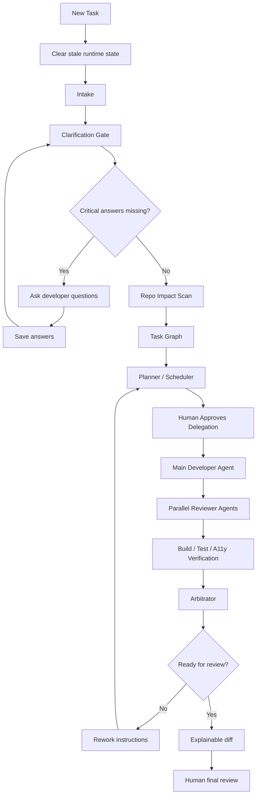

# Oracle Developer Twin Agentic Implementation Plan

Status: Frozen v1  
Date: 2026-05-14  
Owner: ODT product/engineering  

Update, 2026-05-15: the current product direction is implemented in `/Users/vn105957/Desktop/odt-submission/odt-workbench-next`. ODT Workbench is now positioned as a governed AI-assisted developer workbench that moves from requirement/Jira/repo input to PR-ready implementation while enforcing Oracle-style UX, accessibility, security, compliance, 3PL, testing, and code-quality standards. The existing FEDIT/dashboard output remains legacy/reference material; new product work should use the Standards & Governance Layer, Standards Command Center, evidence tables, approval gates, and PR Readiness Pack documented under `odt-workbench-next/docs/`.

Follow-up, 2026-05-15: Intake must support selecting an existing repository or folder by local path, read-only repo analysis, and context attachments through the ODT Context Vault. Uploaded mockups, screenshots, PDFs, DOCX, spreadsheets, API samples, and notes are copied under `odt-workbench-next/workspaces/<assignment>/intake-assets`; they must not be copied into the target repo automatically. ODT Guide may use lightweight local retrieval over docs, standards, evidence, repo analysis, and intake asset metadata to answer with detailed steps until the future Oracle DB vector/RAG layer exists.

Update, 2026-06-04: ODT 2.0 must be treated as an agentic SDLC control plane, not only a dashboard. The first wired execution adapter is Codex CLI. ODT creates governed worker bundles, launches or hands off worker lanes, ingests worker output, extracts cross-lane questions, stores outputs as evidence, and passes prior worker evidence to the next lane. The default write-capable implementation lane is **Senior Full Stack Dev**, acting as a senior IC4 multi-stack developer. Planner and Reviewer remain read-only. Dependency installs stay blocked until package-specific approval is captured. Ordinary reviewed standards blockers may be overridden with notes, but hard safety blockers remain blocked: frontend secrets, destructive actions, and unapproved dependency installs.

Production relay decision, 2026-06-04: cross-lane questions must not live only inside worker-run JSON. Worker runs are immutable execution evidence. Questions, target lanes, human decisions, and route changes become first-class **Agent Relay Items** in the ODT evidence model. The Agent Relay Inbox lets a developer assign a relay item to a lane, record a human answer, reopen it, or select it as context for the next worker. Future worker prompts include a dedicated `Agent Relay Context` section filtered for that lane, plus prior worker output evidence.

Worker monitoring update, 2026-06-04: Codex worker bundles now include a `launch-status.json` lifecycle file. The launch script records `running`, `completed`, `failed`, or `codex_missing` with timestamps and exit code. ODT can refresh worker status from the status file, response file, and log file before ingesting final output. Agent Team shows response/log sizes, latest refresh, launch status, log tail, and explicit Refresh Status / Ingest Output controls.

Execution adapter update, 2026-06-04: ODT must treat Codex, Cline, OCI/OCA, Ollama, OpenAI API, and future engines as execution adapters behind the same governed worker contract. Codex CLI is the first direct-launch adapter. ODT preflights candidate Codex executables, selects a healthy path for the launch script, and reports broken paths as adapter health issues. Authentication remains owned by the local CLI/app, enterprise SSO, IDE extension, or approved provider configuration; ODT stores health/evidence and must not store provider secrets. Live log tail is shown only for delegated worker runs that have a status/log file, and is marked live only while the worker status is active.

Worker evidence and stop-control update, 2026-06-04: ODT can derive implementation evidence from an ingested worker response and store it in the same `implementation_evidence` model used by manual evidence capture. The extractor is deterministic and reviewable: it reads summary, changed-file paths, commands, and test outcomes from worker output, then runs the post-implementation standards check. It must not invent changed files when the worker did not report them. ODT also exposes a governed Stop Worker action. New Codex worker scripts record the child Codex PID and observe a stop-request file; the Stop action writes stop evidence and sends `SIGINT` to the recorded PID when available. If PID control is unavailable, ODT records the request and instructs the developer to press Ctrl+C in the visible Terminal worker.

Current active slice, 2026-06-05: implement the review-cycle loop in the main workplan. Reviewer or human review findings should become rework relay items targeted to **Senior Full Stack Dev Rework**. The next Senior Full Stack Dev launch receives these findings in `Agent Relay Context`, works only on the reviewed scope, and returns rework evidence for another Reviewer/Build Verifier pass. Review comments remain durable human evidence; relay items are the worker-routing copy used for orchestration.

Main workplan implementation update, 2026-06-05: warning/blocker review comments now have a governed route into the agent loop. ODT creates or reuses a rework relay item for the source review comment, exposes `POST /api/review/comments/:commentId/rework-relay`, shows the rework queue on the Review page, and injects review metadata plus required action into `Agent Relay Context` for the next Senior Full Stack Dev launch.

Review-cycle closeout update, 2026-06-05: ODT now derives a **Review Cycle Closeout** state from evidence. When a rework relay exists, PR readiness requires rework implementation evidence, a newer Reviewer rerun, a newer Build Verifier rerun, and then a PR-ready package. The Review page shows the closeout sequence and can open Agent Team with the correct next worker lane selected. `GET /api/review/cycle/:assignmentId/closeout` exposes the derived closeout state for tools and future provider adapters.

Modern AI IDE pattern adoption, 2026-06-05: ODT should learn from modern AI coding tools such as Codex-style agents, Cursor-like repo context, Claude/Anthropic-style plan-first reasoning, and agentic IDE review loops without copying any single product. The ODT pattern is: assemble requirement/repo/assets context, produce a reviewable plan, gate writes through standards and human approval, delegate to a governed worker, stream/log execution evidence, ingest output, run reviewer/build-verifier loops, and prepare PR evidence. ODT's differentiator is enterprise traceability: standards checks, approvals, dependency decisions, relay items, file assets, worker logs, and PR readiness are durable evidence rather than transient chat.

Product positioning update, 2026-06-05: ODT's advantage should be stated clearly in the app and guide: modern AI coding tools help produce work; ODT helps govern, prove, and safely operationalize that work. The platform should support team-specific policy customization for standards, dependency rules, approval gates, worker lanes, model/provider adapters, and PR-readiness criteria. Policy flexibility must not weaken traceability: every override, approval, dependency decision, worker run, and standards result remains auditable evidence.

Policy customization implementation direction, 2026-06-05: the current local path is config-driven customization through `server/standards/odt-standards.json` plus canonical Markdown source documents. Future enterprise ODT should add a Policy Admin UI with role-based access, config validation, impact preview, version publishing, and audit events. Team-level customizations should be allowed for accessibility topics, dependency preferences, testing expectations, UX guidance, approval gates, worker lanes, model/provider adapters, and PR readiness. Hard safety rules such as frontend secrets, destructive actions, unapproved installs, unapproved writes, and external writes should remain protected by explicit policy ownership and audit.

Future intake connector direction: ODT should add governed Jira2/Jira MCP and GitHub MCP intake sources after the current local workbench and relay flow stabilize. These connectors should be read-only by default for intake: pull ticket/issue/PR title, description, acceptance criteria, comments, labels, branch/PR metadata, check status, and attachment metadata into ODT evidence. Any write-back to Jira, GitHub, branches, comments, labels, or PRs must require a separate human approval gate and connector policy review.

Future DB awareness direction: ODT should detect local database configuration from repo files such as `database.yml`, `.env.example`, `config/database.*`, Prisma, Sequelize, Knex, Rails, Spring, or similar configuration files. The first implementation must be metadata-only by default: identify connection candidates, schemas, tables, columns, indexes, constraints, migrations, and safe row-count summaries where approved. Credentials must stay server-side and must not be shown in the frontend or injected into worker prompts. Arbitrary business-data queries, exports, DDL, migrations, INSERT/UPDATE/DELETE, and production-like connections require explicit human approval and a separate DB safety policy.

Future identity and access-control direction: ODT should add enterprise identity after the local MVP stabilizes. The local MVP can continue using OS/local user identity for evidence labels, but production should use SSO/OIDC/SAML or an approved enterprise identity provider. ODT should not store user passwords. AuthN belongs to the provider; ODT stores safe user profile metadata, roles, groups, and audit events. AuthZ belongs to ODT policy: who can approve write scope, override blockers, approve dependencies, launch worker lanes, view sensitive context assets, configure adapters, run DB introspection, or prepare PR packs. All approvals must capture user id, time, role, notes, and assignment id.

Current worker lane target:

```text
Lead Planner -> Senior Full Stack Dev -> Reviewer -> Senior Full Stack Dev Rework -> Build Verifier -> PR Ready
```

Backend worker APIs:

- `GET /api/agents/worker-roles`
- `GET /api/agents/execution-health`
- `POST /api/agents/launch-worker`
- `GET /api/agents/worker-runs/:assignmentId`
- `POST /api/agents/worker-runs/:workerRunId/status`
- `POST /api/agents/worker-runs/:workerRunId/stop`
- `POST /api/agents/worker-runs/:workerRunId/ingest`
- `POST /api/implementation/evidence/from-worker/:workerRunId`
- `POST /api/review/comments/:commentId/rework-relay`
- `GET /api/review/cycle/:assignmentId/closeout`
- `GET /api/agents/relay/:assignmentId`
- `POST /api/agents/relay/:relayItemId/decision`

Durable worker evidence:

- worker role and execution engine
- read-only or write-approved mode
- bundle, handoff, prompt, response, log, and status paths
- launch status lifecycle, response/log sizes, log tail, exit code, and refresh timestamp
- stop request evidence, Codex child PID when available, SIGINT result, and manual Ctrl+C fallback guidance
- parsed output summary
- derived implementation evidence: changed files, commands, tests, source worker, and post-check result
- review-to-rework relay items: source review comment, target artifact, severity, target lane, and required rework instruction
- review-cycle closeout state: rework evidence, Reviewer rerun, Build Verifier rerun, and PR-pack readiness
- questions for another worker lane
- first-class relay items with source worker, target lane, status, decision notes, and prompt-injection context
- run/agent events

Next implementation slice toward the 100% goal:

1. Add a real terminal-launch smoke test for a read-only lane, then a write-approved lane.
2. Harden closeout evidence ingestion: automatically associate Senior Full Stack Dev rework evidence with the rework relay and resolve the relay after human review.
3. Add score/readiness thresholds for stopping the agent loop and asking the developer for final review.
4. Add optional Cline/OCI/OCA adapters behind the same worker contract and relay context pack.
5. Add future read-only Jira2/Jira MCP and GitHub MCP intake connectors behind approval-gated connector policy; do not enable external writes by default.
6. Add future governed DB awareness: repo config detection, local metadata-only schema introspection, approval-gated data queries, and no credential exposure to UI or workers.

This is the frozen implementation plan for evolving Oracle Developer Twin from a static seven-stage planning workflow into a practical, developer-usable agentic delivery workbench.

The plan can be updated later, but this version is the baseline direction.

## North Star

ODT should work like a local AI delivery lead for developers.

It should:

- accept a ticket, defect, or large feature request
- ask critical questions before guessing
- remember answers for the current task
- clear stale state for new tasks
- inspect the repo
- plan the task order
- coordinate one main coding agent and multiple reviewer agents
- pause when human input is needed
- continue when answers are provided
- produce reviewable code, tests, accessibility evidence, and explainable diffs

## Product Decision

Build ODT as:

```text
ODT Studio
  Desktop app: Electron later
  Core engine: Node.js, current ODT packages
  UI: existing FEDIT/ODT Workspace first
  Agents: Codex/Cline/local CLI workers
  Python: optional helper workers only
```

Do not rewrite the core in Python.

Do not start with many agents editing files at the same time.

Start with a safe orchestration model:

```text
Planner / Scheduler
Requirement Clarifier
Repo Cartographer
Architect
Main Developer
Parallel Reviewers
Arbitrator
Human Review
```

## Frozen Workflow



## Agent Roles

### 1. Supervisor

Owns run state, task lifecycle, pause/resume, and stop conditions.

Artifacts:

- `reports/odt/agentic/run-state.json`
- `reports/odt/conversation/state.json`

### 2. Requirement Clarifier

Asks only decision-critical questions.

Examples:

- missing acceptance criteria
- missing target repo
- missing observed/expected behavior for defects
- unclear mock-data policy
- unclear dependency policy
- unclear test scope

Artifacts:

- `reports/odt/clarifications/questions.json`

### 3. Repo Cartographer

Reads the repo and maps likely impacted files/modules.

Artifacts:

- `reports/odt/impact-ranked-files.json`
- `reports/odt/agentic/repo-map.json`

### 4. Task Decomposer

Splits large work into implementation slices.

Artifacts:

- `reports/odt/agentic/task-graph.json`

### 5. Planner / Scheduler

Decides what to do first, what can run in parallel, what is blocked, and what should wait.

This agent is mandatory for large feature work.

Artifacts:

- `reports/odt/agentic/execution-plan.json`
- `reports/odt/agentic/scheduler-decision.json`

### 6. Architect

Checks technical approach, boundaries, reuse, and repo conventions.

Artifacts:

- `reports/odt/tech-design.md`
- `reports/odt/agentic/architect-review.md`

### 7. Main Developer

The only default code-writing agent in v1.

Reason:

- fewer merge conflicts
- clearer ownership
- easier review
- safer for enterprise repos

Artifacts:

- changed files in target repo
- `reports/odt/execute/agent-response.md`

### 8. Reviewer Agents

Run in parallel after the main developer produces code.

Reviewer agents:

- Unit Test Reviewer
- Accessibility Reviewer
- Security / Compliance Reviewer
- Build Verifier
- Architecture Reviewer

Artifacts:

- `reports/odt/agentic/cycles/cycle-N/reviewer-findings.json`
- `reports/odt/agentic/cycles/cycle-N/verify-results.json`

### 9. Optimizer / Rework Agent

Turns reviewer feedback into the next focused workpack.

Artifacts:

- `reports/odt/agentic/cycles/cycle-N/rework-plan.md`
- `reports/odt/agentic/rework-prompt.md`

### 10. Arbitrator

Decides:

- continue
- ask human
- ready for review
- stop due to risk

Artifacts:

- `reports/odt/agentic/cycles/cycle-N/arbitrator-decision.json`

## State Rules

### New Task

When a new task starts, ODT must clear stale runtime state.

Clear:

- old agent logs
- old agent response
- old execution bundle
- old run summary
- old generated workpacks
- old clarification answers
- old conversation state

Keep only:

- source code
- user-uploaded files only if user explicitly keeps them
- persistent app preferences

### Continue Task

When continuing the same task, ODT keeps:

- clarification answers
- current intake
- task graph
- current run state
- previous review-cycle artifacts

But it clears:

- stale delegated-agent response
- stale launch status
- stale temporary logs before a fresh delegation

## UI Plan

First use the existing ODT Workspace.

Add these panels in order:

1. Clarifications Needed
2. Conversation State
3. Task Graph
4. Planner Decision
5. Agent Timeline
6. Review Cycle Scoreboard
7. Explainable Diff

Desktop app comes after the workflow works in the current browser dashboard.

## Implementation Phases

### Phase 1: Conversational ODT

Goal:

ODT can ask, save answers, pause, continue, and clear stale state.

Deliverables:

- clarification backend
- conversation state backend
- stale-state cleanup
- UI panel for questions
- answer form
- continue button
- blocked delegation when critical answers are missing

Estimate:

2-3 working days.

### Phase 2: Planner / Scheduler

Goal:

ODT creates a real execution plan before delegation.

Deliverables:

- task graph artifact
- execution plan artifact
- planner/scheduler decision artifact
- UI panel showing order, parallel lanes, blocked tasks

Estimate:

3-4 working days.

### Phase 3: Reviewer Swarm

Goal:

One main developer agent writes code, reviewer agents inspect in parallel.

Deliverables:

- agent roster
- reviewer prompt templates
- reviewer artifact folders
- parallel reviewer execution
- aggregator/arbitrator

Estimate:

5-7 working days.

### Phase 4: Review Cycle Loop

Goal:

ODT can repeat implementation/review/rework cycles until ready or blocked.

Deliverables:

- review-cycle folders
- scores
- rework plan
- Main Developer rework prompt
- ready/rework/ask-human decision
- stop conditions

Estimate:

5-7 working days.

### Phase 5: Explainable Diff

Goal:

ODT explains changed files and links changes to acceptance criteria and agent feedback.

Deliverables:

- diff parser
- file-level explanations
- acceptance criteria mapping
- review dashboard panel

Estimate:

3-5 working days.

### Phase 6: ODT Studio Desktop App

Goal:

Package the workflow as a Mac developer app.

Deliverables:

- Electron app shell
- repo picker
- embedded ODT Workspace
- local server lifecycle
- notifications/status

Estimate:

7-10 working days after the workflow stabilizes.

## Total Estimate

Useful MVP:

5-7 working days.

This includes:

- clarification/resume
- stale-state cleanup
- planner/scheduler artifact
- basic UI integration

Strong agentic workflow:

15-25 working days.

This includes:

- reviewer swarm
- review-cycle loop
- arbitration
- explainable diff

Desktop product:

25-35 working days total.

This includes:

- agentic workflow
- Electron shell
- polished developer UX

## First Sprint Scope

Freeze the first sprint to this:

1. Backend clarification/resume state.
2. Fresh-task stale-state cleanup.
3. Clarifications Needed UI.
4. Continue button.
5. Task Graph v1.
6. Planner/Scheduler v1.

Do not include in first sprint:

- Electron app
- full reviewer swarm
- multi-coder execution
- learning loop from historical PRs
- complex ML scoring

## Success Criteria

ODT v1 agentic MVP is successful when a developer can:

1. paste a large ticket
2. select a repo
3. let ODT ask missing questions
4. answer questions in the UI
5. continue the same task
6. see task order and blocked work
7. delegate safely
8. start the next task without stale logs or old answers leaking in

## Implementation Status

Completed in the current development pass:

- Phase 1 clarification/resume APIs and dashboard UI.
- Phase 2 task graph, execution plan, scheduler decision artifacts, and dashboard panel.
- Delegation blocking when unresolved high-severity clarification questions exist.
- Fresh-assignment cleanup for clarifications, conversation state, execution bundles, stale logs, and generated workpacks.
- Free-text acceptance-criteria extraction so pasted Jira/story text can become implementation slices.
- Automatic new-assignment cleanup when the work item or target repo changes after a prior run.
- Phase 3 foundation: agent roster and reviewer swarm plan artifacts, rendered in the Planner / Scheduler panel.
- Phase 3 reviewer runner: read-only reviewer prompts, reviewer findings, build verification signal, and merge arbitrator decision.
- Phase 3 review-cycle naming: artifacts use `cycles/cycle-N`, with focused `rework-plan.md` and `rework-prompt.md`.
- Phase 3 verification evidence runner: `POST /odt/verify/run`, `verify-results.json/.md`, dashboard Run Verification action, and cycle-level verification artifacts.
- Phase 3 review-cycle scoreboard: persisted `cycle-history.json/.md`, `/odt/cycle-history`, readiness trend, finding counts, decisions, and verification status in FEDIT.
- Phase 3 focused rework delegation: `POST /odt/rework/launch` clears stale delegated-agent state and opens the selected Main Developer agent with the prepared Review Cycle rework prompt.
- ODT Workbench Next now treats ODT Guide as a handbook/evidence-aware assistant and has a backend-owned GenAI provider direction: local deterministic fallback, OCI/OpenAI/Ollama-ready provider config, safe frontend status, and provider/fallback evidence logging.

## ODT 2.0 Oracle AI Implementation Stages

Use these stages when continuing ODT 2.0 after context loss:

1. **Provider Foundation**
   - Backend-owned provider factory.
   - `GENAI_PROVIDER=local|oci|openai|ollama`.
   - Support OCI setup aliases such as `OCI_GENAI_REGION`, `OCI_GENAI_BASE_URL`, and `OCI_GENAI_API_KEY`.
   - Local deterministic RAG remains default/fallback.
   - OCI GenAI Chat Completions powers Guide when endpoint/model/auth are configured.
   - Monitoring shows provider/model/tokens/latency/fallback.
   - Preserve detailed setup notes in `docs/ODT-Oracle-AI-Services-Setup-Reference.md`.

2. **Enterprise RAG**
   - Add embeddings and rerank.
   - Index handbook, standards, Jira, Confluence excerpts, repo summaries, worker output, review evidence, and PR packs.
   - Use Oracle DB 23ai/26ai vector search for enterprise mode.

3. **Specialist Agent Intelligence**
   - Agent Foundry domains call the provider client.
   - Outputs remain evidence with findings, risks, missing information, standards impact, and next actions.
   - Human review remains mandatory before write/delegate.

4. **Asset Intelligence**
   - Enrich PDFs, DOCX, XLSX/PPTX, screenshots, diagrams, and mockups.
   - Use OCI Document Understanding for PDFs, scanned docs, tables, and forms where approved.
   - Use OCI Vision/document analysis where approved.
   - Use OCI Speech for future voice or meeting-note intake.
   - Preserve fallback to stored metadata/manual review.

5. **Managed Agentic Execution**
   - Evaluate OCI Responses/conversations/files/vector stores/containers/managed agents.
   - Evaluate OCI Generative AI Agents for planner, standards, review, and PR-ready agent-as-tool flows.
   - Keep Codex CLI and Cline/manual adapters.
   - Gate tool use, repo writes, dependency installs, terminal actions, and external writes.

6. **Enterprise Controls**
   - Add SSO/OIDC/SAML and role-based authorization.
   - Add Policy Admin UI for configurable standards/governance.
   - Add Jira/GitHub/Confluence/MCP connectors and DB-aware adapters as read-first, approval-gated capabilities.
   - Add OCI API Gateway plus Functions/OKE as the governed deployment boundary.
   - Add Object Storage/DB audit storage for artifacts, prompts, outputs, approvals, logs, and PR packages.
   - Add memory-service for project memory, relay context, handoffs, and reusable evidence.
   - Add future enterprise config assets:
     - `server/config/oci-genai.json`
     - `server/config/oci-ai-services.json`
     - `server/policies/model-adapters.json`
     - `server/policies/worker-lanes.json`
     - `server/policies/pr-readiness.json`

## Frozen Technical Direction

- Node.js remains the core engine.
- Existing FEDIT dashboard remains the first UI.
- Electron comes later.
- Python is optional for helper workers.
- One main coding agent by default.
- Parallel reviewers are allowed.
- Multiple code-writing agents only after task graph proves disjoint write scope.
- User-facing naming is **Review Cycle**, not "epoch".

## Current Immediate Next Step

Continue Phase 3:

- add agent timeline events for reviewer, verifier, and delegated-code runs
- add a final Review Cycle closeout action after focused rework, verification, and reviewer rerun pass
