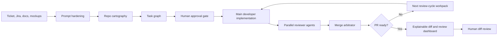

# Oracle Developer Twin Agentic Large Feature Roadmap

Update, 2026-05-15: the current implementation direction is anchored in `/Users/vn105957/Desktop/odt-submission/odt-workbench-next`. Treat the Standards & Governance Layer as mandatory before any large-feature agent loop begins. The old dashboard language in this roadmap should be read as historical context; new UI work should surface the Standards Command Center, Evidence Trail, controlled approval gates, dependency decisions, and PR Readiness Pack.

Follow-up, 2026-05-15: large-feature intake should include repo/folder path selection by local path, base branch, scope, and a governed Context Vault for mockups, docs, spreadsheets, API samples, and notes. Context files are copied into the ODT workspace and remain evidence for planning, standards review, Q&A, and PR readiness. The local MVP can use lightweight retrieval over that evidence while Oracle DB 23ai/26ai vector/RAG remains the enterprise path.

Progress update, 2026-06-04: ODT 2.0 has moved from a dashboard plan into an agentic worker-control-plane direction. Codex CLI is the first wired execution adapter. The Agent Team supports allowlisted worker lanes, with **Senior Full Stack Dev** as the default write-capable implementation lane, plus read-only Planner/Reviewer lanes and a Build Verifier. Worker output is ingested into ODT evidence, cross-lane questions are promoted into first-class Agent Relay Items, and both relay context plus prior worker evidence are included in the next worker prompt. Standards governance remains mandatory: ordinary reviewed blockers can be overridden with notes, but hard safety blockers such as frontend secrets, destructive actions, and unapproved dependency installs remain blocked.

Relay architecture update, 2026-06-04: production ODT should use an **Agent Relay / Decision Inbox** rather than editing source worker output. Source worker runs remain immutable evidence. Relay items carry source worker, target lane, message, status, decision notes, and routing metadata. They can be assigned, answered, resolved, reopened, and injected into the next Codex/Cline/OCI worker prompt. This is the backbone for sequential orchestration now and safer parallel orchestration later.

Worker monitoring update, 2026-06-04: ODT worker bundles should be monitorable before final output ingestion. Codex launch scripts now write `launch-status.json`, and the Agent Team can refresh status from the status file, response file, and log file. The UI surfaces lifecycle state, response/log sizes, exit code, log tail, and explicit refresh/ingest controls.

Execution adapter update, 2026-06-04: ODT should not hardcode a single AI runtime. Codex CLI is the first direct-launch adapter, but the adapter model should support Cline, OCI GenAI/OCA, Ollama, OpenAI API, and internal providers. Each adapter needs health status, auth ownership, capabilities, launch/handoff support, and recent issue evidence. Codex launch uses the user/local enterprise SSO session through the installed CLI/app; ODT verifies the executable path and writes that verified path into the worker launch script. Live log tail belongs to a delegated worker run, not a fake global console, and is shown only when status/log evidence exists.

Worker evidence and stop-control update, 2026-06-04: ODT should treat worker lifecycle as controllable evidence, not just a launched terminal. Worker output can now be converted into implementation evidence and post-check input. The Agent Team should show worker runs as readable cards, not a crowded table, with review, refresh, stop, ingest, and record-evidence actions. Stop Worker should prefer targeted process control using the recorded Codex PID and `SIGINT`; typing Ctrl+C into Terminal is a fallback instruction, not the primary automation, because blindly targeting the frontmost Terminal tab is unsafe when multiple agents or shells are open.

Review-cycle loop update, 2026-06-05: the next production slice is review-to-rework orchestration. Reviewer or human findings should create durable rework relay items targeted to **Senior Full Stack Dev Rework**. The next implementation worker receives those findings through `Agent Relay Context`, performs only the scoped rework, and hands evidence back to Reviewer and Build Verifier. Review comments are the human-review source of truth; relay items are the agent-routing mechanism.

Main workplan update, 2026-06-05: ODT now supports review findings as first-class rework routing input. Open warning/blocker review comments can be sent to the Senior Full Stack Dev Rework lane through a governed API/UI action, the relay is idempotent to avoid duplicate evidence noise, and the next worker prompt includes the review comment id, target artifact, severity, and required rework action.

Review-cycle closeout update, 2026-06-05: ODT now has an evidence-derived closeout sequence for rework cycles: Senior Full Stack Dev rework evidence, Reviewer rerun, Build Verifier rerun, and then PR-ready pack. The Review surface shows the closeout state and can open Agent Team with the required next lane selected. PR readiness treats incomplete closeout as a blocker instead of letting a rework cycle silently skip review or verification.

Modern AI IDE pattern update, 2026-06-05: ODT should explicitly adopt the strongest workflow ideas from modern AI development tools while preserving enterprise governance. The repeatable loop is context assembly, repo-aware analysis, plan-first reasoning, human approval, worker execution, live/logged evidence, review, rework, verification, and PR packaging. Cursor-like repo context, Codex-style terminal delegation, Claude/Anthropic-style structured plans, and IDE-agent review loops are useful references. ODT should improve on them with standards gates, approval events, dependency policy, asset evidence, relay items, and PR-ready audit reports.

Future connector update, 2026-06-04: large-feature intake should later support governed Jira2/Jira MCP and GitHub MCP sources. The first version should be read-only: import Jira ticket data, GitHub issues/PR metadata, branches, check summaries, comments, labels, and attachment metadata into ODT evidence. External writes such as Jira comments/status changes, GitHub comments, branch creation, PR updates, labels, or checks must stay behind explicit human approval and connector policy gates.

Future DB awareness update, 2026-06-04: ODT should include governed local database awareness for repositories that expose database config through `database.yml`, `.env.example`, Rails/Spring config, Prisma, Sequelize, Knex, or similar files. The first capability should detect DB configuration candidates and perform metadata-only schema introspection after approval: schemas, tables, columns, indexes, constraints, migrations, and approved row-count summaries. Credentials stay server-side and masked. Business-data queries, exports, DDL, migrations, INSERT/UPDATE/DELETE, and non-local/prod-like connections require explicit approval and DB safety policy checks.

Future identity and access-control update, 2026-06-05: production ODT should support SSO/OIDC/SAML or an approved enterprise identity provider rather than local passwords. The local workbench can continue with local user mode, but enterprise ODT needs role-aware authorization for write approvals, dependency approvals, blocker overrides, worker launch, adapter configuration, DB introspection, sensitive asset viewing, and PR readiness. ODT stores safe identity metadata, roles, and audit events; it must not store provider secrets or user passwords.

## Purpose

This note captures how Oracle Developer Twin can evolve from a governed seven-stage planning worker into a more advanced agentic delivery studio for large feature implementation, defect remediation, and multi-repo tasks.

The reference Swarm IDE demo is useful because it focuses on the same developer pain ODT is already trying to solve: the developer should not spend the first 30 to 90 minutes babysitting an AI coding session. The stronger product direction is to let ODT plan, monitor, critique, and loop in the background until the output is ready for serious human review.

## What The Swarm IDE Adds

The Swarm IDE pattern has four important ideas:

1. A supervisor controls the workflow instead of the developer manually prompting each step.
2. Agents have narrow roles and durable artifacts instead of one long shared context.
3. Work happens in review cycles: code, critique, arbitrate, improve, score, repeat.
4. The UI shows progress, timeline, scores, and explainable diffs so the human can review on their own schedule.

ODT already has strong governance, repo impact analysis, accessibility/compliance visibility, and execution handoff. The missing upgrade is a clear multi-agent control loop for large implementation work.

## Current ODT Strengths

- Seven-stage flow: intake, impact, design, code workpack, unit tests, compliance, verify.
- Repo-aware planning and ranked impacted files.
- Dashboard evidence for human review.
- Oracle-aligned accessibility and VPAT/WCAG guidance.
- Prompt provider fallback between template and OCI.
- Governed execution bridge for Codex or Cline.
- Runtime artifacts written to `reports/` for auditability.

## Current ODT Gaps For Large Tasks

- The workflow is stage-based, but not yet an autonomous review-cycle loop.
- Agent roles are implied by workpacks, not represented as first-class workers.
- Delegated execution is mostly one agent session, not a monitored agent graph.
- The UI shows generated evidence, but not a live multi-agent timeline.
- There is no formal task graph for decomposing a large feature into parallel workstreams.
- Returned diffs are reviewed by Git tools, but ODT does not yet explain each major change back to the originating agent recommendation.
- There is no score-based stop condition such as "PR readiness is high enough, stop and ask the developer."

## Target Product Direction

Position ODT V3 as:

> Oracle Developer Twin is an agentic delivery control plane that turns a vague work item into a monitored, review-ready implementation path using specialist AI workers, durable evidence, and human approval gates.

The important shift:

- ODT V1/V2: "Plan and govern before delegation."
- ODT V3: "Plan, delegate, monitor, critique, improve, and explain until human review is worth the developer's attention."

## Recommended Agent Roster

Keep the roster small at first. Too many agents create noise.

| Agent | Responsibility | Output |
| --- | --- | --- |
| Supervisor | Owns workflow state, review cycles, stop conditions, and handoffs. | `run-state.json`, cycle decisions |
| Requirement Clarifier | Converts vague tickets into decision-ready questions. | `clarifications/questions.json` |
| Repo Cartographer | Maps modules, ownership, dependencies, and risky files. | `impact-ranked-files.json`, `repo-map.json` |
| Architect | Designs implementation strategy and boundaries. | `tech-design.md` |
| Planner / Scheduler | Chooses task order, parallel lanes, blockers, and next best action. | `execution-plan.json`, `scheduler-decision.json` |
| Task Decomposer | Splits large work into a task graph with dependencies. | `task-graph.json` |
| Main Developer | Applies core implementation changes. | patch or direct repo edits |
| Test Engineer | Adds or updates unit, integration, and regression tests. | `test-plan.md`, test patch |
| Accessibility Reviewer | Checks keyboard, semantics, focus, ARIA, and VPAT mapping. | `a11y-review.md` |
| Security/Compliance Reviewer | Checks dependency, data handling, and policy risks. | `compliance-review.md` |
| Build Verifier | Runs install, lint, tests, build, and app smoke checks. | `verify-results.json` |
| Diff Explainer | Explains why each important file changed. | `diff-explain.md` |
| Merge Arbitrator | Decides if another review cycle is needed or human review should start. | `arbitrator-decision.json` |
| Memory Curator | Compresses useful lessons into durable memory. | `memory/*.md` |

For the first real implementation, use one Main Developer. Let other agents critique in parallel. Only allow multiple code-writing agents when the task graph has disjoint write scopes.

## Large Feature Workflow



## Review Cycle Model

A review cycle is one complete loop:

1. Supervisor prepares the cycle objective.
2. Main Developer implements the next slice.
3. Reviewer agents inspect the result in parallel.
4. Build Verifier runs checks.
5. Diff Explainer records why important files changed.
6. Merge Arbitrator scores readiness and decides whether to continue.
7. Memory Curator writes durable lessons for the next cycle.

Suggested stop conditions:

- PR readiness score >= 8/10.
- No high-severity reviewer objections.
- Tests and build pass or failures are documented as environmental.
- No scope-policy violations.
- No unresolved high-severity clarifications.
- No protected files changed without approval.

## Scoring Model

Avoid one generic score. Use role scores and show them in the dashboard.

| Score | Meaning |
| --- | --- |
| Requirement readiness | Does the implementation satisfy acceptance criteria? |
| Architecture fit | Does it match existing repo patterns? |
| Test confidence | Are happy, edge, and regression paths covered? |
| Accessibility confidence | Are keyboard, labels, semantics, and focus safe? |
| Security/compliance confidence | Are dependency and policy risks controlled? |
| Scope discipline | Did the agent stay within allowed files and blast radius? |
| PR readiness | Can a developer reasonably start final review now? |

The dashboard should show both the current score and the trend across review cycles. A flat or falling trend is a signal to stop and ask the human.

## Dashboard Improvements

The current FEDIT/ODT dashboard should grow into a mission-control view.

Recommended panels:

1. Command Center
   - work item, repo, branch, status, current review cycle, next decision
   - clear buttons: Run Analysis, Approve Delegation, Pause, Resume, Stop, Reset

2. Clarifications Needed
   - open questions, severity, owner, answer box, unresolved blocker count
   - delegation blocked until critical questions are resolved

3. Agent Relay / Decision Inbox
   - cross-lane questions, reviewer needs, human answers, target worker, status
   - source worker output stays immutable; relay items carry decisions forward
   - one-click selection of the next worker lane with relay context injected into the prompt

4. Governed Intake Connectors
   - paste requirement, choose repo/folder, upload context, or import from Jira2/Jira MCP and GitHub MCP
   - read-only connector import by default; external writes require separate approval
   - imported ticket, issue, PR, branch, checks, comments, and attachment metadata become ODT evidence

5. Governed DB Awareness
   - detect local DB config candidates from repo files without exposing secrets
   - connect only after human approval and default to metadata/schema-read-only mode
   - store schema summaries, migration signals, table relationships, indexes, constraints, and safe row-count evidence for agents
   - block business-data export, DDL, migrations, and data mutations unless a separate DB approval gate allows them

6. Task Graph
   - feature split into tasks, dependencies, owners, status, write scope
   - useful for large work where one prompt is too broad

7. Agent Timeline
   - every agent run as a row
   - status, duration, retries, timeout recovery, artifact links
   - similar to the Swarm IDE timeline

8. Review Cycle Scoreboard
   - role scores per cycle
   - trend line showing improvement or regression
   - arbitrator reason for continue/stop

9. Scope and Risk
   - allowed write paths, forbidden paths, max file count
   - changed file risk heatmap
   - dependency and protected file warnings

10. Explainable Diff
   - changed file list
   - why the file changed
   - which agent suggested it
   - acceptance criteria linked to the change

11. Verification Console
   - install, lint, unit tests, build, a11y checks, smoke checks
   - pass/fail logs with short summaries

12. Human Review Gate
   - approve for delegation
   - request rework
   - accept final diff
   - export PR description and evidence bundle

## Artifact Model

Add these artifacts over time:

```text
reports/odt/agentic/
  run-state.json
  agent-roster.json
  task-graph.json
  cycles/
    cycle-001/
      objective.md
      developer-output.md
      reviewer-findings.json
      scores.json
      arbitrator-decision.json
      diff-explain.md
      verify-results.json
  memory/
    repo-patterns.md
    task-lessons.md
    agent-quality-notes.md
```

The key principle is that every important decision should survive outside model context. Context can rot; artifacts can be inspected.

## Implementation Roadmap

### Phase 1: Agentic State Model

Add first-class run states:

- `draft`
- `needs_input`
- `ready_for_review`
- `approved_for_delegate`
- `delegated`
- `cycle_running`
- `diff_review_required`
- `rework_required`
- `accepted`

Generate `reports/odt/agentic/run-state.json` and render it in FEDIT.

### Phase 2: Clarification Gate

Implement the existing V2 clarification idea first. This gives immediate value and prevents large tasks from drifting.

Minimum behavior:

- generate structured questions
- save answers
- block delegation when high-severity questions are open
- include answers in the execution bundle

### Phase 3: Task Graph For Large Work

Create `task-graph.json` from intake plus repo impact.

Each task should include:

- title
- acceptance criteria mapping
- impacted files
- allowed write paths
- dependencies
- suggested agent role
- verification expectations

### Phase 4: Monitored Agent Timeline

Extend `agent-launcher.js` and `local-context.js` to record each agent run, not just the latest launch.

Track:

- agent role
- status
- started/finished time
- duration
- command/provider
- retry count
- artifacts produced
- final summary

Render this as a timeline in FEDIT.

### Phase 5: Reviewer Swarm Without Multi-writer Risk

Start with one code writer and parallel reviewers.

Flow:

1. Main Developer creates patch.
2. Architect, Test, A11y, Security, and Build reviewers inspect patch.
3. Arbitrator creates rework prompt if needed.
4. Main Developer applies the next review cycle.

This is safer than letting many agents edit the same files.

### Phase 6: Explainable Diff

After each delegated run, generate `diff-explain.md`.

For each changed file:

- what changed
- why it changed
- which requirement it supports
- which reviewer requested it
- what risk remains

This makes PR review easier and gives leadership a clear audit trail.

### Phase 7: Worktree Isolation

For advanced runs, create an isolated branch or worktree per run.

Benefits:

- safer experimentation
- cleaner rollback
- easier run-to-run comparison
- no accidental overwrite of developer work

### Phase 8: Learning Loop From Good PRs

Use merged PRs as training examples for better local rules:

1. Take a successful merged PR.
2. Reset a copy of the repo to the previous commit.
3. Run ODT agentic workflow.
4. Compare ODT output to the human PR.
5. Ask a rule-improvement agent what instructions would have improved the result.
6. Update agent role files and prompt contracts.

This should update local rules, not silently change production behavior.

## UI Experience Principles

- The first screen should be a workbench, not a marketing page.
- Large features need a task graph, timeline, and risk map before they need decorative visuals.
- Every agent output should link to a file the developer can inspect.
- The human should see decisions, not raw logs first.
- The UI should make blocked, risky, and ready states unmistakable.
- Do not hide cost and time. Show duration, retries, and low-value review cycles.
- Keep the final approval human-controlled.

## Recommended Next Build

Build an "Agentic Control Plane MVP" in this order:

1. Add `reports/odt/agentic/run-state.json`.
2. Add `reports/odt/agentic/agent-roster.json`.
3. Add a FEDIT `Agent Timeline` panel.
4. Add a FEDIT `Review Cycle Scoreboard` panel.
5. Add `Clarifications Needed` with delegation blocking.
6. Add `task-graph.json` and display the task graph.
7. Extend execution status so each delegated run becomes a timeline event.
8. Add a simple arbitrator that outputs `continue`, `ask_human`, or `ready_for_review`.

This creates the visible agentic experience without requiring the hardest multi-agent execution engine on day one.

## Multi-Agent Feasibility

ODT should use multi-agent workflow, but it should not start with many agents editing files at the same time.

The safest useful pattern is:

```text
Supervisor
  -> Design / Impact Agent reads repo and artifacts
  -> Planner / Scheduler decides task order and parallel lanes
  -> Main Developer Agent writes code
  -> Review agents run in parallel
       -> Architect Reviewer
       -> Unit Test Reviewer
       -> Accessibility Reviewer
       -> Security / Compliance Reviewer
       -> Build Verifier
  -> Optimizer Agent creates rework instructions
  -> Main Developer Agent applies next review cycle
  -> Arbitrator decides ready / rework / ask human
```

### Why One Main Coder First

For large enterprise codebases, the main risk is not that AI cannot produce code. The main risk is conflicting edits, hidden scope drift, and unclear ownership of the final patch.

One main coder keeps the actual patch coherent. Parallel reviewer agents still give the benefit of multi-agent reasoning without multiplying merge conflicts.

### Planner / Scheduler Agent

The Planner / Scheduler agent is important for large tasks because not every step should run immediately.

It should decide:

- which task should be implemented first
- which tasks can run in parallel
- which tasks are blocked by missing answers or backend contracts
- which files each worker may touch
- when a test agent can start
- when an accessibility reviewer can start
- when to stop because the current review cycle is taking too long
- when to ask the developer instead of guessing

Example output:

```json
{
  "currentCycle": 1,
  "currentCycleLabel": "Review Cycle 1",
  "nextAction": "implement_foundation",
  "parallelLanes": [
    {
      "lane": "developer",
      "task": "Add Assessment activity route and form shell",
      "allowedFiles": ["src/journey-builder-app/modules/journey-builder/activities/**"]
    },
    {
      "lane": "test-planner",
      "task": "Prepare unit test matrix from acceptance criteria",
      "allowedFiles": ["reports/odt/agentic/cycles/cycle-001/**"]
    }
  ],
  "blockedTasks": [
    {
      "task": "Save/publish integration",
      "reason": "Backend contract is not ready; use fixture boundary only."
    }
  ],
  "humanQuestion": null
}
```

This makes ODT behave more like a development lead coordinating parallel developers, not just a prompt generator.

### When To Allow Multiple Coding Agents

Use multiple code-writing agents only when the task graph proves write scopes are disjoint.

Good example:

- Agent A owns frontend component files.
- Agent B owns unit tests only.
- Agent C owns docs or migration notes only.

Bad example:

- three agents all edit the same component tree
- one agent refactors while another adds behavior
- one agent changes package dependencies while another updates lockfiles

### Expected Usefulness

High usefulness:

- large feature implementation
- codebase impact discovery
- accessibility-heavy UI work
- dependency/security remediation
- test creation and gap review
- PR explanation and reviewer prep

Medium usefulness:

- small one-file bug fixes
- simple copy changes
- mechanical refactors that already have strong codemods

Low usefulness:

- tasks with no clear acceptance criteria
- tasks where product decisions are still missing
- tasks requiring live backend contracts that do not exist yet

### Plugin / Codex Integration Direction

ODT should expose itself in three ways:

1. ODT Studio desktop app for humans.
2. ODT CLI commands for automation.
3. ODT Codex skill/plugin wrapper for developers already working inside Codex.

The plugin should not contain the whole product. It should be a thin launcher that lets Codex call ODT commands, read ODT artifacts, and continue/rework the current assignment.

Recommended plugin commands:

```text
odt.newTask
odt.askClarifications
odt.answerClarification
odt.continue
odt.runImpact
odt.delegate
odt.status
odt.explainDiff
odt.cleanStaleState
```

This keeps ODT independent from any one agent tool while still making it easy for Codex to use.

## Product Pitch

For large tasks, ODT should not promise "AI writes all the code." The stronger promise is:

> ODT gives developers a monitored AI delivery team that clarifies the requirement, splits the work, controls scope, executes safely, reviews itself, and brings the human back only when there is reviewable evidence.

That is the advanced agentic version of Oracle Developer Twin.

## ODT 2.0 Oracle AI / GenAI Upgrade Roadmap

ODT 2.0 should be positioned as an Oracle-internal-ready agentic SDLC control plane. Oracle AI services should improve analysis, retrieval, guide quality, specialist reviews, asset understanding, and managed agent execution, while ODT remains the authority for workflow state, governance, approvals, evidence, and PR readiness.

### Stage A: Unified Provider Client

Status: in progress in ODT Workbench Next.

Scope:

- Backend-owned `GENAI_PROVIDER=local|oci|openai|ollama`.
- Support OCI setup aliases such as `OCI_GENAI_REGION`, `OCI_GENAI_BASE_URL`, and `OCI_GENAI_API_KEY`.
- Local deterministic RAG remains default and fallback.
- OCI GenAI Chat Completions can power ODT Guide when endpoint, model, compartment, and backend auth are configured.
- OpenAI-compatible and Ollama adapters follow the same interface.
- Frontend shows only safe provider readiness and fallback status.
- Monitoring logs provider, model, latency, tokens, error, and fallback evidence.
- Preserve detailed setup notes in `docs/ODT-Oracle-AI-Services-Setup-Reference.md`.

Success criteria:

- ODT Guide works without any remote provider.
- When OCI is configured, ODT retrieves handbook/evidence context and sends it with the user question.
- If OCI fails, ODT answers locally and records fallback evidence.

### Stage B: Enterprise RAG With Embeddings And Rerank

Scope:

- Replace keyword-only ranking with embedding search and rerank.
- Index ODT handbook, standards, assignment evidence, worker output, PR packs, Jira text, repo summaries, Confluence excerpts, uploaded text assets, and historical review evidence.
- Use SQLite/local index for development and Oracle DB 23ai/26ai vector search for enterprise mode.
- Use OCI Generative AI embeddings and rerank where configured.

Success criteria:

- ODT Guide and Agent Foundry answers become requirement-specific instead of generic.
- Evidence answers cite the most relevant ODT artifact, requirement, repo analysis, standards finding, or worker output.
- Retrieval source lists are stored with AI usage evidence.

### Stage C: OCI-Enhanced Specialist Domain Reviews

Scope:

- Agent Foundry domains use the provider client for richer Requirements, UX, Product, Architecture, Development, Code Review, Compliance, CI/CD, QA, and Operations reviews.
- Missing information and clarification questions become first-class evidence/relay items.
- Human review remains required before write/delegate actions.

Success criteria:

- Full SDLC and focused-domain reviews are more requirement-specific.
- Standards impact, recommendations, risks, and required approvals are traceable.
- No specialist output silently unlocks implementation.

### Stage D: Context Asset Intelligence

Scope:

- Use approved parsers and Oracle AI services to enrich PDFs, DOCX, XLSX/PPTX, screenshots, diagrams, mockups, and audio/video-derived transcripts.
- OCI Document Understanding can extract text, tables, forms, and structured fields from PDFs and scanned/document-heavy intake.
- OCI Vision or approved image/document analysis can describe UI mockups, extract OCR-like text, and identify accessibility or layout risks.
- OCI Speech can support future audio/meeting-note intake.
- Text-to-speech can support accessibility-oriented walkthroughs.
- OCI GenAI Files and Vector Stores can hold extracted context for provider-backed retrieval where approved.

Success criteria:

- Uploaded assets produce role, summary, extracted text/visual notes, requirement links, and risk flags.
- Failed enrichment falls back to stored metadata and manual review.
- No asset is sent to a provider without configured policy and user/tenant approval.

### Stage E: Managed Agentic Adapter

Scope:

- Evaluate OCI Generative AI Responses, conversations, files, vector stores, containers, and managed agent/tool patterns.
- Evaluate OCI Generative AI Agents for planner, standards, review, and PR-ready agent-as-tool flows.
- Keep Codex CLI/Cline/manual adapters available.
- Add adapter-level approvals for tool use, repo writes, dependency installs, external calls, and terminal actions.

Success criteria:

- ODT can choose Codex CLI, Cline/manual, OCI managed agent, Ollama/local, OpenAI-compatible, or another approved execution adapter.
- Worker tasks run sequentially or in safe parallel lanes according to the task graph and file-ownership plan.
- Relay context from Planner, Developer, Reviewer, Verifier, and Rework flows is passed to the next worker.

### Stage F: Enterprise Identity, Policy, Connectors, And DB Awareness

Scope:

- Add SSO/OIDC/SAML integration and role-based authorization.
- Govern who can approve write scope, override blockers, approve dependencies, edit policy, launch workers, inspect DBs, and perform external writes.
- Add Jira/GitHub/Confluence/MCP connectors as read-first, approval-gated adapters.
- Add database awareness from safe local config discovery and approved DB introspection.
- Add OCI API Gateway plus Functions/OKE as the governed deployment boundary for ODT APIs.
- Add OCI Object Storage and DB-backed audit storage for raw artifacts, prompts, outputs, approvals, logs, and PR packages.
- Add memory-service integration for project memory, handoffs, ACL-scoped context, and reusable evidence.
- Add policy/config assets for enterprise operation:
  - `server/config/oci-genai.json`
  - `server/config/oci-ai-services.json`
  - `server/policies/model-adapters.json`
  - `server/policies/worker-lanes.json`
  - `server/policies/pr-readiness.json`

Success criteria:

- ODT records who approved what, under which role and policy version.
- Team policy can be customized without code changes.
- External connector writes and DB actions require explicit approval and audit evidence.
