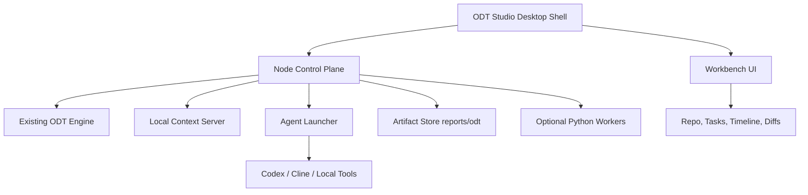

# Oracle Developer Twin Developer Productization Plan

Update, 2026-05-15: the clean product implementation now lives at `/Users/vn105957/Desktop/odt-submission/odt-workbench-next`. The product direction is ODT Workbench as a governed AI-assisted developer workbench, not only a desktop shell or dashboard. New work should preserve the legacy/generated dashboard, then build through the backend Standards & Governance Layer, evidence storage, approval-gated agent execution, and PR Readiness Pack described in `odt-workbench-next/docs/ODT-Governance-Architecture.md`.

Follow-up, 2026-05-15: the developer-facing product must begin from an existing project. Intake should capture a local repo/folder path, base branch, work scope, requirement/Jira text, and context attachments. Attached mockups, documents, spreadsheets, and API samples are copied to the ODT workspace as evidence, not written into the target repo. The ODT Guide should use lightweight local retrieval over standards, docs, evidence, and uploaded context metadata so Q&A returns concrete steps and current captured state.

## Decision

Build ODT as a desktop developer workbench, with the current Node.js engine as the core runtime.

Recommended first product shape:

```text
ODT Studio for Mac
  Desktop shell: Electron first
  Core engine: existing Node.js ODT packages
  UI: live dashboard/workbench
  Agent execution: Codex/Cline/local tools
  Optional analyzers: Python workers later
```

Do not rewrite the whole product in Python. Python is useful for specialty analyzers, document parsing, ML experiments, and report generation, but it should not become the main UI/control-plane layer.

## Why Electron First

ODT already has:

- Node.js CLIs
- local HTTP context server
- generated HTML/JS dashboards
- filesystem artifacts under `reports/`
- agent launch code using local processes

Electron fits this shape because it can package the existing web UI and Node control plane into a real desktop app without a major rewrite.

The practical advantage is speed: we can make developers feel like they are using a product quickly, then improve internals behind it.

## Why Not Python As The Main App

Python desktop options can work, but they are not ideal as the primary product path here:

- ODT already lives in JavaScript/Node.
- The current dashboard is web-based.
- Agent launching, local server state, and npm workflows are already implemented in Node.
- A Python UI would duplicate the control plane or force a rewrite.
- Packaging Python desktop apps for enterprise machines can become its own maintenance project.

Use Python where it is strongest:

- parse PDFs, Word docs, Excel files, and logs
- compute code metrics
- analyze test reports
- summarize historical PRs
- run local ML-style heuristics

## Why Not Native SwiftUI First

A SwiftUI Mac app would feel polished, but it would slow us down because:

- the current ODT UI would need to be rebuilt
- Node execution still needs to be bridged
- cross-platform support becomes harder
- feature iteration would be slower

SwiftUI can be a future premium shell if ODT proves valuable and the team wants a highly native Mac experience.

## Tauri Later, Not First

Tauri is attractive because it is lighter and security-oriented, but it adds Rust and a different desktop integration model. It is a good second-generation packaging option once the product surface stabilizes.

For now:

- Electron = fastest path to a usable internal developer product
- Tauri = later optimization path
- SwiftUI = later premium Mac-native path
- Python = supporting worker layer, not the main shell

## Product Name

Working name:

**ODT Studio**

Tagline:

**A local AI delivery workbench for turning tickets into governed, review-ready code.**

## Developer-Focused MVP

The first real product should solve developer workflow pain, not demo storytelling.

### 1. Repo Launcher

Developer opens ODT Studio and selects a local repo.

Show:

- repo path
- branch
- Git status
- package manager
- detected framework
- last ODT run

### 2. Work Item Intake

Developer pastes a Jira ticket, defect, or feature request.

Support:

- title
- summary
- acceptance criteria
- constraints
- target modules
- attached files
- reviewer notes

### 3. Clarification Gate

Before running agents, ODT asks only decision-critical questions.

Examples:

- What is the expected empty state?
- Should this affect admin and learner users?
- Is backward compatibility required?
- Is this allowed to add dependencies?

Critical unanswered questions block delegation.

### 4. Agentic Plan

ODT generates:

- task graph
- impacted files
- allowed write scope
- test plan
- accessibility expectations
- risk notes
- implementation order

### 5. Agent Timeline

Show each agent/job as a timeline row:

- Intake
- Impact
- Architect
- Main Developer
- Test Reviewer
- A11y Reviewer
- Build Verifier
- Arbitrator

Each row should show:

- status
- duration
- artifact link
- failure/retry count
- short result

### 6. Execution Control

Developer can:

- approve delegation
- run Codex/Cline
- pause
- stop
- rerun one stage
- reset state
- open logs

### 7. Diff Review

After execution, ODT should show:

- changed files
- explanation per file
- acceptance criteria mapping
- test evidence
- risk flags
- final reviewer checklist

Developer still reviews the actual Git diff before merge.

## Suggested Desktop Architecture



## Proposed Repo Structure

Add a desktop app package:

```text
apps/odt-studio/
  package.json
  electron/
    main.js
    preload.js
  src/
    App.jsx
    routes/
    components/
    styles.css
  vite.config.js
```

Keep existing packages:

```text
packages/accessibility-ai-shield/
packages/delivery-copilot/
```

The desktop shell should call the existing packages instead of copying their logic.

## First Engineering Milestone

Build a local desktop workbench that can:

1. select a repo
2. show repo health
3. edit intake
4. run ODT
5. show generated artifacts
6. show agent launch status
7. open the generated dashboard

This gives developers a real app while preserving the current engine.

## Second Engineering Milestone

Add agentic workflow features:

1. `run-state.json`
2. `agent-roster.json`
3. `task-graph.json`
4. agent timeline events
5. clarification blocking
6. review-cycle scoreboard
7. explainable diff view

## Third Engineering Milestone

Add safer execution:

1. worktree or branch per run
2. allowed write paths
3. protected file policy
4. max changed file count
5. dependency policy
6. restore checkpoint
7. final accept/rework decision

## User Experience Standard

ODT Studio should feel like an engineering cockpit:

- dense but calm
- fast to scan
- no marketing hero page
- clear status
- clear blocked states
- every artifact inspectable
- every agent action traceable
- human approval visible

The developer should be able to leave the app running while working elsewhere, come back, and immediately understand:

- what happened
- what is blocked
- what changed
- what needs review
- what ODT recommends next

## Recommendation

Start with Electron because it gets us to a usable Mac app fastest with the least rewrite.

Keep the engine in Node.

Use Python only as an optional worker layer.

Move to Tauri or SwiftUI only after ODT Studio has proven the workflow and the UI is stable.
