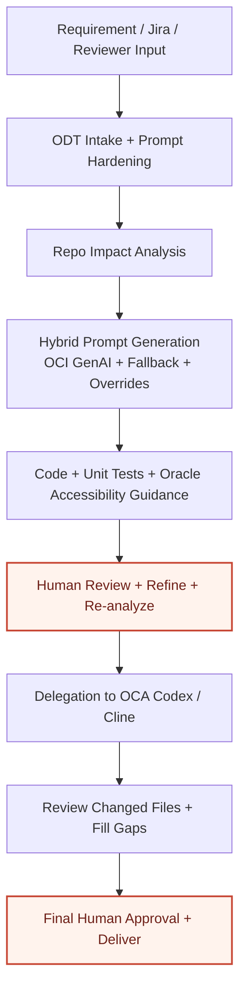

# Oracle Developer Twin Architecture Slide

Use this as the backup source for the technical architecture slide.

## Slide Message

ODT is the governed planning and review layer.
OCA is the execution path.
OCI GenAI is optional for stage-prompt generation.
Accessibility guidance is introduced before delegation.
Human review remains mandatory before delegation and before merge.

## Recommended Visual Structure

1. Three columns with three stacked steps each
2. Phase 1: understand and scope
3. Phase 2: prepare and govern
4. Phase 3: execute and approve
5. Highlight review checkpoints in a governance color
6. Call out OCI as optional inside the hybrid prompt step
7. Add a bottom strip saying a11y enters before delegation and is revalidated at final review

Keep OCI as an optional prompt path, not the center of the slide.
Keep human review visible both before delegation and at final approval.

## Slide-Ready Copy

- Phase 1:
  Requirement / Jira / Reviewer Input
  ODT Intake + Prompt Hardening
  Repo Impact Analysis
- Phase 2:
  Hybrid Prompt Generation
  Code + Unit Tests + Oracle A11y Guidance
  Human Review + Refine + Re-analyze
- Phase 3:
  Delegation to OCA Codex / Cline
  Review Changed Files + Fill Gaps
  Final Human Approval + Deliver
- Governance line:
  Accessibility enters at step 5 before delegation.
  Human review happens at step 6 before OCA execution and at step 9 before delivery.

## Mermaid Diagram

## Presenter Notes

Say it in one sentence:

"ODT plans and governs, OCI can optionally improve stage prompt generation, accessibility guidance appears before delegation, OCA executes, and the human still owns the approval decision."

Alternative short line:

"ODT plans and governs the work, OCI can optionally generate stage prompts, OCA executes the implementation path, and the human remains the approval gate before and after execution."

Optional appendix note:

"If judges want technical depth, use the appendix slide to show where accessibility enters, where human review can refine before delegation, and reinforce that no direct auto-merge path exists."
