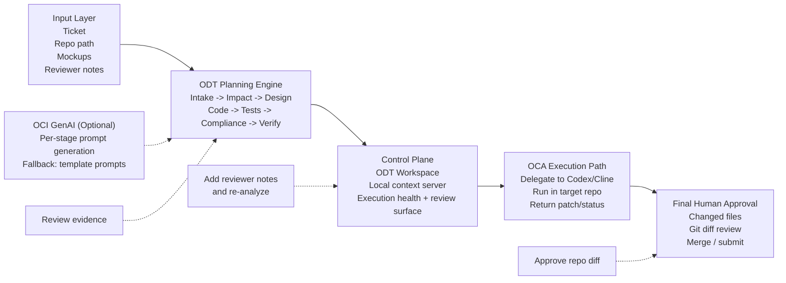

# Oracle Developer Twin Architecture Slide

Use this as the backup source for the technical architecture slide.

## Slide Message

ODT is the governed planning and review layer.
OCA is the execution path.
OCI GenAI is optional for stage-prompt generation.
Human review remains mandatory before merge.

## Recommended Visual Structure

1. Input layer
2. ODT planning engine
3. Control plane and review surface
4. OCA execution path
5. Final human approval

Keep OCI as an optional side feed into planning, not the center of the slide.
Keep human review as a bottom governance strip, not a footnote.

## Slide-Ready Copy

- Input layer: ticket, repo path, mockups, reviewer notes
- ODT planning engine: intake, impact, design, code, tests, compliance, verify
- Control plane: ODT Workspace, local context server, execution health, review surface
- OCA execution path: delegate to Codex or Cline, execute against target repo, return patch/status
- Human gate: review evidence, add notes and re-analyze, approve repo diff before merge

## Mermaid Diagram

## Presenter Notes

Say it in one sentence:

"ODT plans and governs, OCI can optionally improve stage prompt generation, OCA executes the implementation path, and the human still owns the approval decision."

Alternative short line:

"ODT plans and governs the work, OCI can optionally generate stage prompts, OCA executes the implementation path, and the human remains the approval gate."

Optional appendix note:

"If judges want technical depth, use the appendix slide to show the detailed OCA execution path and reinforce that no direct auto-merge path exists."
