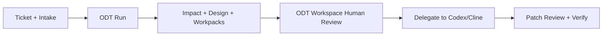

# Oracle Developer Twin Implementation Guide

## Executive Summary
Oracle Developer Twin (ODT) is a human-reviewed AI Digital Worker for software delivery. It transforms ticket-level intent into a governed SDLC plan, then delegates execution to coding agents with explicit human approval gates.

## Digital Worker Intent
- ODT owns planning and governance; it does not auto-merge code.
- ODT Workspace is the visible operator console for intake, explainability, and run controls.
- Codex/Cline execute implementation tasks from ODT-generated execution prompts and workpacks.

## Problem Statement
- Manual pre-coding work (analysis, impact mapping, quality planning) is repetitive and inconsistent.
- Large repos make safe impact inference difficult without structured signals.
- Accessibility and keyboard requirements often arrive too late in delivery cycles.
- Coding agents need structured context and guardrails to produce safe output.

## How ODT Solves It
1. Captures ticket + acceptance criteria + constraints through intake.
2. Runs repo-aware impact analysis and produces ranked impacted files.
3. Produces technical design, code workpack, and unit-test workpack artifacts.
4. Adds VPAT/WCAG and keyboard remediation guidance.
5. Exposes everything through ODT Workspace with health, status, and human review checkpoints.

## Runtime Architecture
- Planning engine: `packages/accessibility-ai-shield/src/commands/odt.js`
- Repo analysis engine: `packages/accessibility-ai-shield/src/commands/dev-twin.js` + `src/dev-twin/impact.js`
- Experience layer: `packages/accessibility-ai-shield/src/odt/fedit.js` -> `reports/odt/fedit.html`
- Control plane: `packages/delivery-copilot/src/local-context.js`
- Agent launcher: `packages/delivery-copilot/src/agent-launcher.js`

## End-to-End Flow

## Current Metrics
- Automation coverage: 100%
- Pipeline stages completed: 7/7
- Candidate files surfaced: 12
- Blast radius: 18
- Net time reduction estimate: 24% (5 hours)
- Accessibility triage reduction: 83%
- Accessibility blockers (current baseline): 497

## Stage Contracts and Safety
- Contract files: `reports/odt/prompts/01-*.md` to `07-*.md` and `stage-contracts.json`.
- Each contract declares Inputs, Task, Output schema, Quality gates, and Stop conditions.
- External prompt safety artifacts:
  - `reports/odt/prompts/external-llm-sanitized-context.json`
  - `reports/odt/prompts/external-llm-safety.md`

## What Developers Provide
- Required: summary, acceptance criteria, work item type.
- Recommended: non-functional requirements, constraints, and design references.
- Optional: suspected impact hints and related components.
- Target repository path is configurable for existing repos or scaffold folders.

## Step-by-Step Usage
1. Start local context server: `npm run mcp:local:serve`
2. Initialize intake: `npm run dev:twin:init`
3. Update `reports/dev-twin/intake.json`
4. Run digital worker: `npm run odt:run -- --profile react-js --withA11y`
5. Review dashboard: `http://localhost:8080/reports/odt/fedit.html`
6. Prepare execution handoff: `npm run odt:execute`
7. Delegate to agent and review diffs before merge

## Local Control Plane APIs
- `GET /health`
- `GET /context`
- `POST /intake`
- `POST /repo/pick`, `POST /repo/status`, `POST /repo/init-git`
- `POST /files/upload`
- `POST /odt/run`, `POST /odt/execute`, `POST /odt/agent/launch`

## Frontend and UX Capabilities in ODT Workspace
- Workflow stepper with stage-level status and readiness signal.
- Run/Retry/Delegate/Apply/Reset controls with safe button states.
- Repo health badge and guidance for Git/non-Git/empty-folder scenarios.
- Agent launch status, log tail preview, and response preview for traceability.
- Artifact tabs for design, impact, accessibility, code, tests, and PR draft text.

## Key Paths
- `packages/accessibility-ai-shield/bin/a11y-shield.js`: CLI entrypoint for scan, twin, dev-twin, and ODT commands.
- `packages/accessibility-ai-shield/src/commands/odt.js`: Main ODT orchestrator: intake, impact, design, workpacks, compliance, dashboards.
- `packages/accessibility-ai-shield/src/commands/odt-execute.js`: Execution bridge: builds agent prompt bundle and applies reviewed diffs.
- `packages/accessibility-ai-shield/src/commands/dev-twin.js`: Repo-aware planning engine that generates summary, workpacks, and dashboard.
- `packages/accessibility-ai-shield/src/dev-twin/impact.js`: Whole-repo candidate file inference, manifest scoring, and blast radius analysis.
- `packages/accessibility-ai-shield/src/dev-twin/dashboard.js`: HTML dashboard for planning evidence and inferred repo impact.
- `packages/accessibility-ai-shield/src/odt/fedit.js`: ODT Workspace React-style demo UI with controls, charts, and agent delegation panel.
- `packages/accessibility-ai-shield/src/odt/dashboard.js`: Enterprise ODT dashboard renderer.
- `packages/accessibility-ai-shield/src/twin/parser.js`: Accessibility findings parser and priority engine.
- `packages/accessibility-ai-shield/src/twin/dashboard.js`: A11y Twin dashboard renderer.
- `packages/accessibility-ai-shield/src/policy/oracle-vpat-policy.json`: Oracle-aligned VPAT/WCAG policy mapping used by compliance guidance.
- `packages/delivery-copilot/src/local-context.js`: Local HTTP control plane for health, run, execution, and status endpoints.
- `packages/delivery-copilot/src/agent-launcher.js`: Visible delegation to Codex/Cline and launch artifact handling.
- `reports/dev-twin/intake.json`: Developer input contract: ticket summary, acceptance criteria, constraints, hints.
- `reports/dev-twin/intake-missing-fields.md`: Intake readiness checklist and missing-field severity report.
- `reports/dev-twin/code-workpack.md`: Scoped implementation workpack for coding agents or developers.
- `reports/dev-twin/unit-test-workpack.md`: Suggested regression test updates and quality gates.
- `reports/odt/tech-design.md`: Technical design artifact generated by ODT.
- `reports/odt/run-summary.md`: Run health, status, and review summary.
- `reports/odt/fedit.html`: Projectable demo dashboard for leadership and judges.
- `reports/odt/prompts/stage-contracts.json`: Machine-readable 7-stage prompt contracts with schema and quality gates.
- `reports/odt/prompts/external-llm-sanitized-context.json`: Redacted intake context for safe external prompt drafting.
- `reports/odt/prompts/external-llm-safety.md`: External LLM guardrails and review checklist.
- `reports/odt/impact-ranked-files.md`: Ranked impacted files with confidence and regression risks.
- `reports/odt/code-patch-plan.md`: File-by-file patch intent and dependency policy checks.
- `reports/odt/unit-test-matrix.md`: Happy/edge/error/keyboard test matrix with anti-flake guidance.
- `reports/odt/compliance-mapping.md`: VPAT/WCAG and keyboard gap mapping with remediation priority.
- `reports/odt/verify-checklist.md`: Go/no-go release checklist with blockers and approval gates.
- `reports/odt/execute/prompt.md`: Execution handoff prompt for Codex/Cline.
- `reports/a11y/coding-agent-prompt.md`: Accessibility remediation guidance based on VPAT/WCAG + keyboard parity.
- `reports/a11y-twin/index.html`: Accessibility dashboard with top rules, hotspots, and verify state.
- `docs/Oracle-Developer-Twin-Developer-SOP.md`: One-page developer SOP for day-to-day ticket handling.

## Commands
- Start local control plane: `npm run mcp:local:serve`
- Serve local dashboards: `python3 -m http.server 8080`
- Initialize intake: `npm run dev:twin:init`
- Run ODT planning pipeline: `npm run odt:run -- --profile react-js`
- Run ODT with accessibility: `npm run odt:run -- --profile react-js --withA11y`
- Open ODT Workspace dashboard: `http://localhost:8080/reports/odt/fedit.html`
- Prepare execution bundle: `npm run odt:execute`
- Dry-run reviewed patch: `npm run odt:execute -- --response-file reports/odt/execute/agent-response.md --dry-run`
- Apply reviewed patch and verify: `npm run odt:execute -- --response-file reports/odt/execute/agent-response.md --verify`
- Accessibility scan/demo: `npm run a11y:twin:demo`

## Business Impact
- Productivity: structured planning before coding reduces repetitive coordination effort.
- Quality: test and accessibility thinking becomes default, not an afterthought.
- Governance: every stage persists evidence artifacts that are reviewable and auditable.
- Adoption: developers keep familiar tools (Codex/Cline/Git), while ODT standardizes orchestration.

## Current Limits and Next Steps
- ODT currently excels in planning and governed delegation; execution still requires human review.
- Multi-technology profiles can be expanded beyond current defaults.
- Repo-decoupled accessibility scanning for external target repos is the next practical extension.

## Deliverables
- `docs/Oracle-Developer-Twin-Hackathon-Deck.pptx`
- `docs/Oracle-Developer-Twin-Implementation-Guide.docx`
- `docs/Oracle-Developer-Twin-Implementation-Guide.md`
