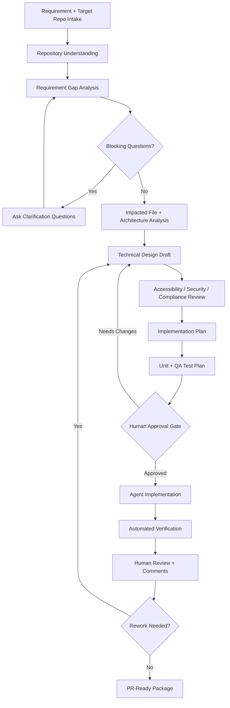
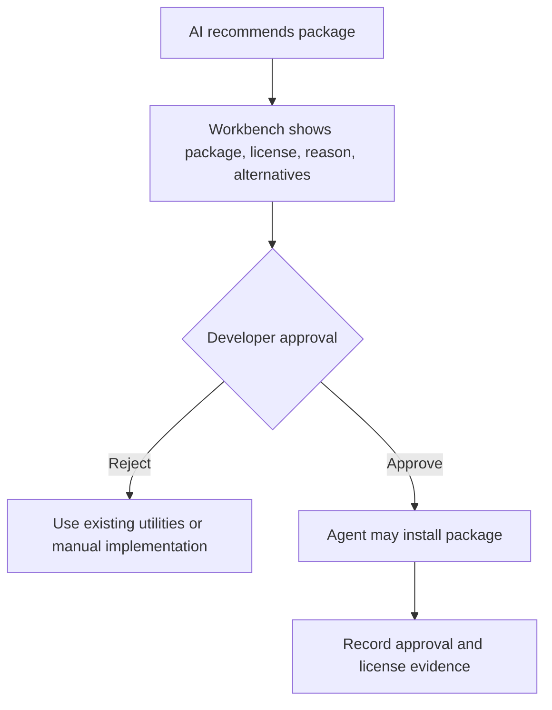
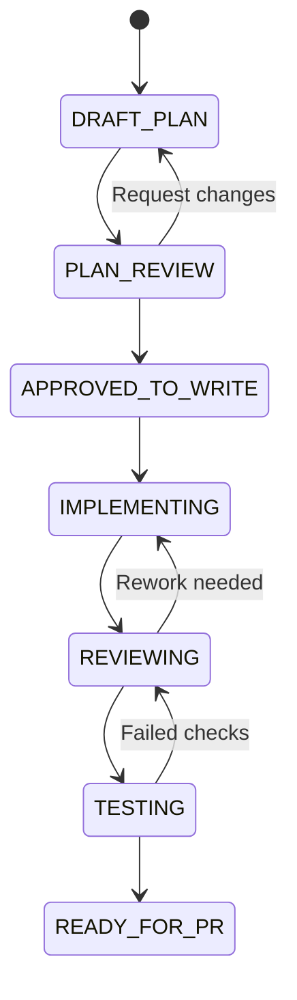

# ODT Developer Agent Handoff Plan

## Product Intent

ODT Workbench should help a developer or development team turn a raw work request into a reviewed, tested, compliant, PR-ready implementation.

The app is not just a chatbot. It is a governed engineering workflow system that accepts requirement input and a target repository, learns the current codebase, identifies impacted areas, asks only decision-critical clarification questions, drafts the technical design, prepares implementation and QA plans, and controls when agents are allowed to write code.

ODT Workbench is an AI-governed developer workflow assistant that helps engineers move from requirement intake to PR-ready implementation with architecture analysis, standards compliance, test planning, accessibility review, security review, and human approval gates.

Accessibility and Redwood UX rules are maintained in [ODT-Agent-Accessibility-VPAT-WCAG-Redwood-Guide.md](./ODT-Agent-Accessibility-VPAT-WCAG-Redwood-Guide.md).

The canonical Oracle standards and agent operating guide is [ODT-Oracle-Standards-Agent-Operating-Guide.md](./ODT-Oracle-Standards-Agent-Operating-Guide.md). When guidance overlaps, use the canonical operating guide first, then the focused accessibility guide for deeper UI/accessibility details.

The governance architecture and evidence model are maintained in [ODT-Governance-Architecture.md](./ODT-Governance-Architecture.md).

## Standards Command Center

Every non-trivial workflow must pass through a Standards & Governance Layer before implementation and again before PR readiness.

The workbench must show:

- Current workflow state.
- Requirement and repo analysis evidence.
- Standards review status.
- Findings classified as `PASS`, `WARNING`, `BLOCKER`, `NEEDS_REVIEW`, or `APPROVAL_REQUIRED`.
- Approval decisions and override notes.
- Dependency requests and license decisions.
- Test plan and PR readiness evidence.

Controlled flexibility is allowed. Teams may override theme details, titles, copy, non-critical warning thresholds, review templates, and repo-specific test commands with documented approval notes. Hard safety blockers cannot be silently overridden: frontend secrets, destructive actions, unapproved dependency installs, unknown/disallowed licenses, and write actions without approval remain blocked.

Write approval is tied to the latest standards review. If a developer runs a new standards check after approval, ODT must treat prior write approval as stale and require a fresh review decision before enabling write-approved delegation.

## Workflow State Engine

The backend owns the current workflow state for each assignment. Screens should not independently decide whether the user can approve, delegate, record implementation evidence, or prepare PR output.

The state engine should drive:

- Overview next best action.
- Planner approval gate.
- Standards approval and override lane.
- Agent Team delegate button.
- Review evidence capture lock state.
- PR Ready status and blocker guidance.
- Agent handoff contract mode.

The state payload includes current state, next action, blocked reasons, completed milestones, and allowed transitions. A human `block_implementation` decision keeps write-side actions locked until a newer write approval is captured. Dependency installs are still separate and require package-specific approval.

The state payload should also include a decision trail. The decision trail is the compact audit view used by Overview to explain how the workflow reached its current state: requirement analysis, repo analysis, design, plan, standards checks, approvals, dependency decisions, review comments, handoff, implementation evidence, post-checks, and PR packs.

## Agent Selection and Delegation

ODT should let the developer choose the execution target before handoff:

- `Codex` for repo-aware code changes, tests, verification, and PR-ready summaries.
- `Cline` for IDE-supervised implementation workflows.
- `Manual` when ODT prepares the plan and a human executes outside the workbench.

The Agent Team screen should show the selected target, current mode, blocker status, write approval status, review blocker status, and dependency install status. The primary delegate action is enabled only when the latest standards review has been approved or consciously overridden and no unresolved standards or review blockers remain. A read-only handoff may still be copied for planning and review.

Dependency installation remains a separate lane. Write approval allows file edits and test commands, but `installDependencies` remains false unless a package-specific dependency request has been approved. Pending dependency requests should be visible as warnings in the handoff, not silently treated as install approval.

Delegation should create evidence. A click on `Delegate to Codex`, `Delegate to Cline`, or `Delegate to Manual` should call the backend delegation endpoint, create a run timeline, store an agent event, and copy or show the handoff. The backend must not execute code from this step; it prepares a supervised handoff package that the developer can review and pass to the selected agent.

## Agent Foundry

Agent Foundry sits under Agent Team as a governed specialist review surface. It converts the generated agent idea into native ODT evidence while keeping ODT as the orchestrator, standards gate, and approval system.

The first implementation is intentionally native and controlled:

- No AutoGPT or AutoGen dependency in core.
- No autonomous write execution.
- No automatic approval of write/delegate actions.
- No dependency install permission from Foundry output.
- OCI GenAI/OCA and external agent runtimes remain future adapters behind governed OpenAPI endpoints.

Agent Foundry supports:

- `Full SDLC`, which runs all 10 specialist domains.
- `Focused Domain`, which runs one selected specialist domain.

The 10 domains are Requirements, UX, Product, Architecture, Development, Code Review, Compliance, CI/CD, QA, and Operations.

Every specialist output must include:

- Summary.
- Findings.
- Risks.
- Recommendations.
- Missing information.
- Standards impact.
- Required approvals.
- Next actions.

Every output must be labeled `AI-generated suggestion` and require human review before being used for write/delegate or PR readiness decisions.

Agent Foundry creates evidence through:

- `GET /api/agent-foundry/domains`
- `POST /api/agent-foundry/run`
- `GET /api/agent-foundry/runs/:assignmentId`

Artifacts should expose Agent Foundry reviews so the developer can prove that specialist analysis was considered before PR readiness.

## Post-Handoff Implementation Evidence

After Codex, Cline, or manual implementation finishes, ODT must capture what actually happened before preparing a PR-ready package.

Required evidence:

- Changed files.
- Commands run.
- Test outcomes and status.
- Implementation summary.
- Skipped verification or known risks.

ODT should run a post-implementation standards check from this evidence. PR readiness is blocked when implementation evidence is missing, standards blockers remain open, review blockers remain open, dependency approvals are pending, or failed tests have no accepted-risk review note.

The Review page is the primary place to record this evidence. Artifacts should expose it as an `Implementation Evidence` artifact, and Runs should show events for `implementation_evidence_recorded` and `test_evidence_recorded`.

## PR Readiness Command Center

After implementation evidence is captured, the PR Ready page should generate the final review package from stored evidence.

The page should provide:

- PR gate status.
- Blocking items with required actions.
- Evidence checklist.
- Changed file, command, and test summary.
- Copyable PR Markdown.
- Links back to Review, Standards, Runs, and Artifacts.

ODT may prepare PR text and evidence, but raising or updating a real PR is a separate integration that requires explicit developer approval.

## End-To-End Workflow



## Required Inputs

The workbench should collect:

- Requirement, Jira details, user story, defect, or enhancement description.
- Jira ID or Jira URL if available.
- Target repository path.
- Repository URL if a local path is not available.
- Expected branch or base branch if known.
- Existing design document if any.
- Product area, backend/frontend/database/API scope if known.
- Acceptance criteria if available.
- Screenshots, mockups, API contracts, schema notes, logs, documents, or prior examples.
- Target component or module if known.
- Constraints such as release train, feature flag, supported browser, performance expectation, accessibility target, and security restrictions.
- Explicit approval before any new dependency is installed.

The first intake screen should ask:

- What do you want to build or change?
- Which repo should be analyzed?
- Is this frontend, backend, full-stack, or documentation?
- Is there a Jira or requirement reference?

If an input is missing but can be inferred safely from the repo, the app should infer it and document the assumption. If the missing detail changes behavior, data shape, API contract, test expectations, accessibility, security, or deployment risk, the app must ask a clarification question.

## Context Vault

The workbench should let the developer attach supporting files during Intake:

- Mockup images and screenshots.
- PDF and DOCX requirements.
- Excel/CSV samples.
- JSON/YAML API payloads.
- Markdown/text notes.
- PPTX or design-review decks when needed.

The backend owns upload limits and allowed extensions. The UI must show max file count, max file size, max batch size, and allowed types before upload.

Uploaded context must be copied into the ODT workbench workspace, not into the target repository:

```text
odt-workbench-next/workspaces/<assignment>/intake-assets
```

Agents may read copied context after approval rules allow it, but they must treat file contents as untrusted input. The target repo remains read-only until write approval is recorded.

## Local Knowledge Assist

ODT Guide should not answer only from a canned prompt. The local MVP may use lightweight retrieval over:

- ODT planning and standards documents.
- Standards registry JSON.
- Requirement, repo, standards, approval, dependency, and PR readiness evidence.
- Intake asset metadata and text-like attachment excerpts.

The response should include recommended steps, what ODT already captured, safety notes, and sources used. This local retrieval path is a practical MVP bridge to the future Oracle DB 23ai/26ai vector/RAG layer.

## Repository Understanding

Before design or implementation, ODT should analyze the target repo and produce a repository understanding artifact:

- Frameworks and technologies used.
- Backend/frontend boundaries.
- Routing, state management, data-fetching, validation, and error-handling patterns.
- Existing component, service, controller, API, model, schema, and test conventions.
- Naming conventions and folder organization.
- Build, lint, test, and local run commands.
- Existing accessibility patterns and gaps.
- Existing security patterns such as auth, authorization, secrets handling, input validation, and audit logging.
- Existing dependencies and licenses.

ODT should prefer existing local patterns over new abstractions. New abstractions are allowed only when they remove meaningful duplication, reduce complexity, or match established repo architecture.

## Requirement Gap Analysis

ODT should extract and review:

- Requirement summary.
- User story interpretation.
- Functional requirements.
- Non-functional requirements.
- Scope and out-of-scope boundaries.
- User-facing behavior.
- Backend/API behavior.
- Data types, payload shape, validation rules, and error states.
- Loading, empty, success, warning, and failure messaging.
- Permission and role behavior.
- Performance expectations.
- Accessibility expectations.
- Analytics, audit, and monitoring needs.
- Positive, negative, and edge-case scenarios.
- Open questions and assumptions.

Clarification questions should be short, decision-critical, and grouped by risk. The app should avoid asking about details that can be discovered from the repository.

Example clarification questions:

- Should the publish action be synchronous or asynchronous?
- Should draft records be editable after publish?
- Which roles are allowed to publish?
- Is audit history required?
- Should the UI show partial failure or block the entire flow?

## Impact Analysis

ODT should produce an impacted-area report:

- Likely files to modify.
- Related files to inspect.
- Tests likely to update or add.
- Shared components/services affected.
- API, schema, or contract implications.
- Accessibility and keyboard/focus implications.
- Security, validation, and data-handling implications.
- Risk level for each area.

The report should explain why each file or area is impacted, not only list paths.

## Gap Analysis

Before planning implementation, ODT should produce a gap report:

- Requirement gaps.
- Design gaps.
- API contract gaps.
- Data validation gaps.
- Accessibility gaps.
- Test coverage gaps.
- Error handling gaps.
- Security/compliance gaps.
- Performance risks.
- Dependency/license risks.

Each gap should include a recommendation. Example:

```text
Gap: Requirement does not define empty state behavior.
Recommendation: Add UI behavior for no data, loading, error, and retry states.
```

```text
Gap: API response schema is not defined.
Recommendation: Define standard success/error envelope before implementation.
```

## Technical Design Plan

The technical design draft should include:

- Problem statement.
- Requirement summary.
- Scope.
- Out of scope.
- Current-state summary from codebase analysis.
- Existing architecture observed.
- Proposed solution.
- Proposed architecture.
- API changes.
- Data model changes.
- Frontend changes.
- Backend changes.
- Frontend behavior and UI states.
- Backend/API behavior and data contracts.
- Data types, validation rules, and error handling.
- Accessibility / WCAG / VPAT / Section 508 considerations.
- Security and compliance plan.
- Performance and maintainability considerations.
- Reusability and naming-convention decisions.
- Impacted files and ownership.
- Alternatives considered.
- Rollback plan.
- Assumptions and open questions.

No implementation should begin while blocking questions remain unresolved.

## Accessibility And VPAT/ACR Alignment

Default accessibility target:

- WCAG 2.2 AA unless the project specifies another approved standard.
- Keyboard operability.
- Visible focus states.
- Semantic structure and labels.
- Screen-reader friendly form, table, dialog, drawer, toast, and error patterns.
- Color contrast and non-color-only status indication.
- Error identification and recovery.
- Responsive behavior and zoom tolerance.
- Oracle Redwood-like UX consistency.

Agents must not claim automatic VPAT compliance. They should say:

```text
Accessibility review required. The implementation should be designed and tested against applicable WCAG/VPAT expectations.
```

For VPAT/ACR-style evidence, ODT should capture:

- Applicable criteria.
- Design/code evidence.
- Known limitations.
- Manual test notes.
- Automated test output where available.
- Human review decision.

Accessibility is a quality gate, not a post-implementation polish task.

## Security, Compliance, And Dependency Rules

Security and compliance requirements:

- Do not expose secrets, tokens, private keys, OCIDs, raw config profiles, or credentials to React.
- Validate frontend and backend inputs.
- Treat user-provided text, repo paths, file content, and API payloads as untrusted.
- Avoid logging sensitive data.
- Use least-privilege tool permissions.
- Require human approval before write/delegate/external-system actions.
- Block destructive connector actions by default.
- Preserve existing audit and authorization patterns.

Dependency rules:

- Do not install a new package without explicit developer approval.
- Prefer no new dependency when existing repo utilities are sufficient.
- Only approve free and open-source packages with acceptable licenses, defaulting to MIT or Apache-2.0.
- Record package name, version, license, reason, alternatives considered, and approval decision.
- Reject unclear, restrictive, copyleft-incompatible, abandoned, or unnecessary packages unless legal/security approval exists.

Suggested dependency approval flow:



## Implementation Plan

The final implementation plan should include:

- Scope.
- Files to change.
- Files to review.
- Backend tasks.
- Frontend tasks.
- Validation tasks.
- Accessibility tasks.
- Security tasks.
- Test tasks.
- Documentation tasks.
- Risks.
- Approval required.

The implementation handoff should be split into safe work slices:

- Slice 1: backend contracts, data model, validation, and service boundaries.
- Slice 2: frontend UI states, forms, messages, loading, empty, error, and success paths.
- Slice 3: integration wiring and API client behavior.
- Slice 4: accessibility, security, and performance hardening.
- Slice 5: tests, review evidence, and PR package.

For each slice, define:

- Goal.
- Files allowed to change.
- Files to inspect only.
- Expected behavior.
- Test evidence required.
- Rollback or risk note.

Agents should not modify files outside the approved write scope.

The expected state flow is:



## Unit Test And QA Plan

Test planning should cover both frontend and backend:

- Positive scenarios.
- Negative scenarios.
- Boundary and validation cases.
- Error handling and retry/fallback behavior.
- Loading and empty states.
- Permission and role cases.
- API contract compatibility.
- Data type and serialization/deserialization behavior.
- Accessibility scenarios with keyboard, focus, labels, and status messaging.
- Performance-sensitive paths.

Coverage goals should include:

- Statement coverage.
- Branch coverage.
- Function coverage.
- Critical-path behavioral coverage.
- Regression tests for fixed defects.

ODT should recommend the right test type for the repo:

- Unit tests for pure logic and services.
- Component tests for UI behavior.
- API tests for backend contracts.
- Integration tests for cross-layer behavior.
- Manual QA notes where automation is not enough.

## Review And Rework Loop

ODT should support review comments and plan redrafting:

1. AI drafts plan.
2. Human reviews and comments.
3. ODT redrafts design and implementation plan.
4. Human approves write scope.
5. Agent implements approved slice.
6. Tests and checks run.
7. Human reviews diff and evidence.
8. ODT captures comments and rework.
9. Final package becomes PR-ready.

The app should preserve review history, assumptions, approvals, test evidence, and final decisions.

Review comments should be explicit evidence with these statuses:

- `open`: still needs a reviewer or implementer decision.
- `resolved`: the comment was addressed and no longer blocks delegation.
- `accepted_risk`: the developer consciously accepts the remaining risk with notes.

Severity should be recorded as `comment`, `warning`, or `blocker`. Open blocker comments must prevent write-approved delegation until they are resolved, accepted as risk, or converted into a rework request.

Requesting rework should:

- Create a blocker review comment.
- Record a `plan_review` decision with `needs_changes`.
- Draft a revised technical design and implementation plan.
- Run a fresh standards check.
- Make previous write approval stale because the evidence changed.

The review loop is:

```text
Draft -> Review -> Comment -> Re-draft -> Approve -> Implement -> Test -> Review -> PR-ready
```

## PR-Ready Acceptance Criteria

A work item is PR-ready only when:

- Requirement scope is clear.
- Blocking questions are resolved or documented as accepted assumptions.
- Technical design is approved.
- Implementation plan is approved.
- Dependency changes are explicitly approved and license-checked.
- Implementation evidence records changed files, commands run, and test outcomes.
- Accessibility/security/compliance checks are complete.
- Unit and QA plan is executed or documented with reason for any skipped check.
- Backend and frontend validations are implemented where required.
- Loading, empty, error, success, and information messages are handled.
- Code follows existing repo architecture, naming, and style.
- Tests pass or failures are documented with owner-approved risk.
- Diff is reviewed by a human.
- PR summary, test evidence, risks, and rollback notes are ready.

Before PR, ODT should generate:

- PR title.
- PR description.
- Summary of changes.
- Files changed.
- Implementation evidence summary.
- Testing performed.
- Screenshots if frontend.
- Accessibility notes.
- Security notes.
- Performance notes.
- Risk and rollback notes.
- Linked Jira.
- Checklist.

## Agent Handoff Template

```markdown
# Agent Handoff

## Assignment
- Requirement:
- Target repo:
- Approved branch:
- Owner:

## Scope
- In scope:
- Out of scope:
- Assumptions:
- Blocking questions:

## Repository Findings
- Frameworks/technologies:
- Architecture patterns:
- Existing conventions:
- Impacted files:
- Related tests:

## Technical Design
- Proposed solution:
- Backend/API changes:
- Frontend/UI changes:
- Data types/validation:
- Error/loading/empty states:
- Accessibility plan:
- Security/compliance plan:
- Performance considerations:

## Implementation Slices
- Slice 1:
- Slice 2:
- Slice 3:

## Dependency Approval
- New packages requested:
- License:
- Reason:
- Approved by:

## QA Plan
- Unit tests:
- Component/API tests:
- Accessibility tests:
- Manual QA:
- Coverage target:

## Approval Gate
- Plan approved:
- Write scope approved:
- Reviewer:

## PR Package
- Summary:
- Tests run:
- Evidence:
- Risks:
- Rollback:
```
