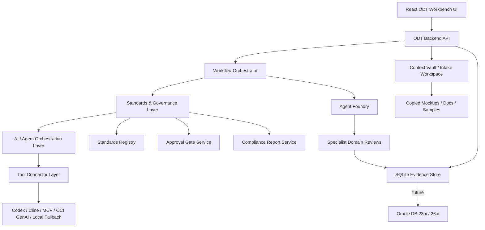

# ODT Governance Architecture

## Direction

ODT Workbench is a governed AI-assisted developer workflow platform. It takes requirement, Jira, and repo inputs; analyzes requirements and existing code patterns; identifies gaps and impacted files; drafts technical design and implementation plans; validates those plans against Oracle-style UX, accessibility, security, testing, dependency, and PR-readiness standards; requires human approval before write actions; guides Codex/Cline implementation; records execution evidence; and prepares PR-ready output.

The product should feel like a Standards Command Center for developer work: calm, reviewable, transparent, and human-controlled. It is not only a chat surface, a reporting dashboard, or an agent launcher.

## Architecture



## Governance Layer Responsibilities

- Check every non-trivial plan and output against standards.
- Classify findings as `PASS`, `WARNING`, `BLOCKER`, `NEEDS_REVIEW`, or `APPROVAL_REQUIRED`.
- Block implementation when critical findings or unresolved approvals exist.
- Derive a single workflow state from evidence so every UI page and agent handoff uses the same current gate.
- Store standards checks, findings, approvals, dependency requests, test plans, and PR readiness reports as evidence.
- Store Agent Foundry specialist reviews as advisory evidence, not as automatic approvals.
- Store post-handoff implementation evidence: changed files, commands, test outcomes, and known risks.
- Generate an agent contract that clearly marks read-only vs write-approved modes.

## Controlled Flexibility

ODT standards must be configurable because teams, themes, release trains, and product surfaces vary.

Allowed flexibility:

- Theme details, labels, page titles, and Redwood-like visual tuning.
- Non-critical warnings approved with notes.
- Team-specific standards replacing baseline standards through registry/config updates.
- Different test commands, coverage thresholds, or review templates when the target repo requires them.

Hard blockers:

- Frontend exposure of secrets, tokens, private keys, raw OCI config, OCIDs, or credentials.
- Destructive tool actions.
- New dependency installation without explicit developer approval.
- Unknown or disallowed dependency licenses without review.
- Write/delegate actions before human approval for the latest standards review.

Write approval is intentionally scoped to the current standards evidence. If a new standards check is run, ODT must return the agent contract to read-only mode until a new approval or controlled override is captured.

## Evidence Model

SQLite v1 stores:

- `requirements`
- `repo_analysis`
- `technical_designs`
- `implementation_plans`
- `standards_checks`
- `standards_findings`
- `approval_events`
- `dependency_requests`
- `review_comments`
- `test_plans`
- `implementation_evidence`
- `pr_readiness_reports`
- `intake_assets`
- `agent_foundry_runs`

This gives ODT a reviewable evidence trail: what was checked, what passed, what was warned or blocked, what was approved, what a reviewer sent back, what changed during implementation, which commands and tests ran, what risk was accepted, and what remains before PR readiness.

Agent Foundry evidence stores the specialist domain, phase, input sources, generated findings, recommendations, required approvals, provider/model label, and created time. It is always labeled as an AI-generated suggestion and requires human review before use in write/delegate or PR-ready decisions.

## Agent Foundry

Agent Foundry is a native governed review layer under Agent Team. It uses the generated agent concept as inspiration, but ODT does not copy AutoGPT or AutoGen behavior into core for this slice.

MVP domains:

- Requirements: user stories, MoSCoW-style gaps, acceptance criteria, and clarifications.
- UX: Redwood-like UX, user journeys, WCAG/VPAT/Section 508 considerations, and keyboard behavior.
- Product: PRD clarity, prioritization, roadmap fit, and user value.
- Architecture: C4-style boundaries, APIs, ADRs, data model, extension points, and rollback.
- Development: implementation tasks, APIs, components, validation, and repo patterns.
- Code Review: OWASP sanity, SOLID/maintainability, and reviewer readiness.
- Compliance: privacy, auditability, security, VPAT, and policy notes.
- CI/CD: build commands, release gates, pipeline readiness, and rollback checks.
- QA: test strategy, positive/negative/boundary/error cases, and coverage expectations.
- Operations: runbooks, monitoring, fallback, incident response, and support readiness.

Full SDLC mode runs all 10 domains and returns one grouped deliverable. Focused mode runs one domain. Foundry output feeds Artifacts, Runs, the decision trail, standards conversations, and PR readiness review, but it does not approve write scope or dependency installs.

## Workflow State Engine

ODT derives the current workflow state from stored evidence instead of letting each screen calculate its own gate. This prevents mismatches such as Standards saying a plan is approved while Agent Team still keeps delegation disabled.

The state engine returns:

- current state and label
- current workflow stage
- next best action
- blocked reasons with target page
- completed milestones
- allowed actions
- evidence counts
- latest standards, implementation, and PR report ids
- decision trail summarizing the evidence events that explain why the workflow is in its current state

The MVP states are:

```text
INTAKE_STARTED
REQUIREMENT_ANALYZED
REPO_ANALYZED
TECH_DESIGN_DRAFTED
STANDARDS_REVIEW_PENDING
PLAN_REVIEW
STANDARDS_REVIEW_PASSED
APPROVED_TO_WRITE
IMPLEMENTING
IMPLEMENTATION_EVIDENCE_RECORDED
POST_IMPLEMENTATION_REVIEW
PR_READY
BLOCKED
```

Human block decisions are respected until a newer write approval is recorded. Dependency installs remain a separate approval path and do not become allowed just because write scope is approved.

The Overview workflow panel should expose the decision trail directly so developers can answer: what was reviewed, what was approved or blocked, what evidence was recorded, and which page should be opened to act on the item.

## Context Vault and Repository Intake

ODT Workbench must support starting from an existing project, not a blank chat.

The Intake flow allows a developer to provide:

- Target repository or folder path.
- Base branch.
- Scope such as frontend, backend, full-stack, or documentation.
- Requirement/Jira text and acceptance criteria.
- Mockups, screenshots, PDFs, DOCX files, spreadsheets, API samples, Markdown, text, and related context.

Repository and folder analysis is read-only by default. Uploaded context is copied into the ODT workbench workspace under `workspaces/<assignment>/intake-assets`. ODT must not place uploaded files into the target repo unless a future approved workflow explicitly asks for it.

The upload policy is backend-owned and exposed safely to the UI: allowed extensions, maximum files per request, maximum file size, and maximum batch size. These limits are governance controls, not just UI hints.

## Local Knowledge Assist

The MVP includes lightweight local retrieval for ODT Guide. It builds a local corpus from the standards documents, standards registry, assignment evidence, repo analysis, standards findings, approval events, implementation evidence, PR readiness reports, and intake asset metadata or text excerpts.

This gives Q&A detailed, grounded steps while preserving the future architecture:

- Local keyword retrieval is the MVP path.
- OCI GenAI remains behind backend provider abstraction.
- Oracle DB 23ai/26ai vector search remains the enterprise RAG path.
- Future OCI GenAI Agent calls must still go through governed OpenAPI endpoints.

## Governance API Surface

The backend exposes the governance workflow through:

- `POST /api/intake/analyze`
- `GET /api/intake/upload-policy`
- `POST /api/intake/assets`
- `GET /api/intake/assets/:assignmentId`
- `GET /api/intake/assets/:assetId/file`
- `POST /api/repo/analyze`
- `POST /api/design/draft`
- `POST /api/plan/draft`
- `GET /api/standards`
- `POST /api/standards/check`
- `GET /api/standards/checks/:assignmentId`
- `POST /api/approvals`
- `POST /api/review/comments`
- `POST /api/review/comments/:id/status`
- `POST /api/review/rework`
- `POST /api/implementation/evidence`
- `POST /api/implementation/post-check`
- `GET /api/implementation/evidence/:assignmentId`
- `POST /api/dependencies/request`
- `POST /api/dependencies/:id/approve`
- `POST /api/dependencies/:id/reject`
- `POST /api/pr/prepare`
- `GET /api/workflow/state/:assignmentId`
- `GET /api/assignments/:id/evidence`
- `GET /api/assignments/:id/agent-contract`
- `POST /api/agents/delegate`
- `GET /api/agent-foundry/domains`
- `POST /api/agent-foundry/run`
- `GET /api/agent-foundry/runs/:assignmentId`

All governance endpoints are included in `/openapi.json` so future OCI GenAI Agent/tool-calling integration can operate through the same governed backend contract.

## Agent Handoff Runs

Delegation is an auditable preparation step, not automatic code execution.

When the developer selects Codex, Cline, or Manual and clicks Delegate, ODT should:

- Build the current agent contract.
- Verify the contract is write-approved when write delegation is requested.
- Verify no open review blocker remains. A reviewer may resolve the blocker, accept the risk with notes, or request rework.
- Record run events for delegation requested, contract created, and handoff prepared.
- Record an assignment-level agent event.
- Copy or display the handoff for the developer.
- Keep dependency installation blocked unless a package-specific dependency request is approved.
- Show pending dependency requests as handoff warnings, not as install permission.

This makes delegation visible in Runs and Artifacts while preserving the rule that ODT orchestrates and records, and Codex/Cline implement only through an approved handoff.

## Implementation Evidence and Post-Check

After Codex, Cline, or a manual developer finishes implementation, ODT must record post-handoff evidence before PR readiness:

- Changed files.
- Commands run.
- Test outcomes with `passed`, `failed`, `skipped`, `not_run`, or `unknown`.
- Implementation summary.
- Known risks or skipped verification.

Recording implementation evidence runs a post-implementation standards check by default. PR readiness is blocked when implementation evidence is missing, open standards blockers remain, review blockers remain open, dependency requests are still pending, or failed test results exist without accepted-risk review notes.

## PR Readiness Command Center

The PR Ready surface turns stored evidence into reviewable PR output. It must show:

- Overall PR gate status.
- Blocking items and required actions.
- Evidence-backed checklist.
- Changed files, commands, and test outcomes.
- Accessibility, security, dependency, risk, and rollback notes.
- Copyable Markdown for the developer-owned PR description.

ODT should prepare the PR package, not silently raise a PR. Creating or updating an external PR remains a separate approved integration path.

## Architecture Decision Records

### ADR-005: Standards Governance Layer

Decision: Introduce a Standards & Governance Layer between Workflow Orchestrator and AI/Agent execution.

Reason: ODT Workbench must ensure that generated plans and implementation outputs comply with Oracle-style accessibility, security, UX, dependency, testing, and PR readiness expectations.

Consequence: Every non-trivial workflow must pass standards checks before write execution and before PR readiness.

### ADR-006: Approval-Gated Agent Execution

Decision: Agents operate in read-only mode by default and require explicit human approval before write actions. The approval must be newer than the latest standards check.

Reason: Prevents accidental file changes, dependency installs, external updates, and non-compliant implementation.

Consequence: Agent actions must be auditable and tied to approval events. Running a newer standards check invalidates older write approvals until the developer reviews the latest findings.

### ADR-007: Standards Evidence Storage

Decision: Store standards checks, findings, approvals, dependency decisions, and PR readiness reports in SQLite.

Reason: Provides traceability and review evidence for each work item.

Consequence: ODT can show why a plan was approved, blocked, sent back, accepted with risk, or marked PR-ready.

### ADR-008: Configurable Standards

Decision: Store standards and policy rules as configurable Markdown/JSON assets.

Reason: Oracle/team standards may evolve, and the workbench should not require code changes for every policy update.

Consequence: The standards registry becomes a reusable local knowledge source for agents.

### ADR-009: Agent Foundry Specialist Evidence

Decision: Add Agent Foundry as a native ODT specialist review surface that stores Full SDLC and focused-domain outputs as evidence.

Reason: ODT needs specialist domain coverage without introducing autonomous write agents or ungoverned AutoGPT/AutoGen behavior in core.

Consequence: Foundry reviews are AI-generated suggestions, require human review, and can inform standards, artifacts, and PR readiness. They never approve write/delegate actions or dependency installs by themselves.

### ADR-010: Review And Rework Evidence

Decision: Store human review comments as first-class evidence and allow comments to be open, resolved, or accepted as risk.

Reason: ODT must show where a blocker came from, who reviewed it, whether it was fixed or consciously accepted, and whether the plan was reworked before delegation.

Consequence: Open blocker comments prevent write-approved delegation. Requesting rework creates a blocker comment, drafts revised design and plan artifacts, and runs a fresh standards check so stale write approvals do not carry forward.

### ADR-011: Implementation Evidence Before PR Readiness

Decision: Store changed files, commands, test outcomes, and implementation summaries as first-class implementation evidence.

Reason: PR readiness should be based on what actually happened after handoff, not only on the pre-implementation plan.

Consequence: ODT runs post-implementation standards checks from recorded evidence and blocks PR readiness when evidence is missing, failed tests are unaddressed, review blockers remain open, or dependency approvals are unresolved.

### ADR-012: Backend-Derived Workflow State

Decision: Derive workflow state in the backend from assignment evidence and expose it through evidence, snapshot, and `GET /api/workflow/state/:assignmentId`.

Reason: ODT needs one authoritative source for next actions, blockers, completed milestones, and allowed transitions across Overview, Planner, Standards, Agent Team, Review, and PR Ready.

Consequence: UI pages and agent handoffs must consume the derived state instead of maintaining independent approval logic. Human block decisions keep delegate/write-evidence/PR-ready actions locked until a newer approval clears the decision.
